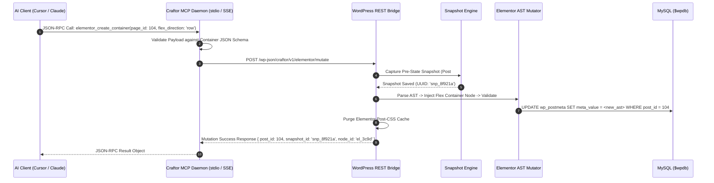

# Example: System Topology & Transaction Flow Diagram

```mermaid
sequenceDiagram
    autonumber
    participant Client as AI Client (Cursor / Claude)
    participant MCP as Craftor MCP Daemon (stdio / SSE)
    participant Bridge as WordPress REST Bridge
    participant Snap as Snapshot Engine
    participant AST as Elementor AST Mutator
    participant DB as MySQL ($wpdb)

    Client->>MCP: JSON-RPC Call: elementor_create_container(page_id: 104, flex_direction: 'row')
    MCP->>MCP: Validate Payload against Container JSON Schema
    MCP->>Bridge: POST /wp-json/craftor/v1/elementor/mutate
    Bridge->>Snap: Capture Pre-State Snapshot (Post #104 _elementor_data)
    Snap-->>Bridge: Snapshot Saved (UUID: 'snp_8f921a')
    Bridge->>AST: Parse AST -> Inject Flex Container Node -> Validate
    AST->>DB: UPDATE wp_postmeta SET meta_value = <new_ast> WHERE post_id = 104
    Bridge->>Bridge: Purge Elementor Post-CSS Cache
    Bridge-->>MCP: Mutation Success Response { post_id: 104, snapshot_id: 'snp_8f921a', node_id: 'el_3c9d' }
    MCP-->>Client: JSON-RPC Result Object
```
