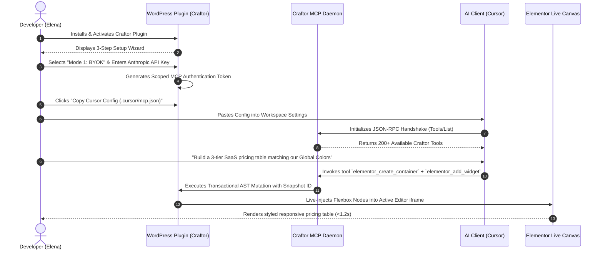
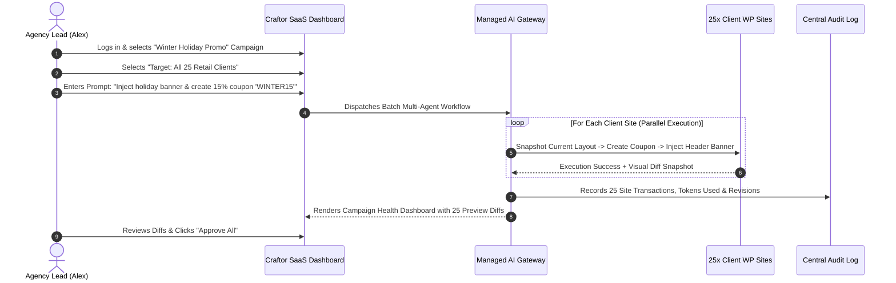

# Craftor — End-to-End User Journeys

**Document ID:** JRN-2026-001  
**Project Name:** Craftor  
**Version:** 1.0.0  

---

## 1. Journey Overview & Lifecycle Stages

```
┌──────────────────────────────────────────────────────────────────────────────────────────────────┐
│                                   CRAFTOR USER LIFECYCLE FLOW                                    │
├───────────────────┬───────────────────┬───────────────────┬───────────────────┬──────────────────┤
│ STAGE 1           │ STAGE 2           │ STAGE 3           │ STAGE 4           │ STAGE 5          │
│ DISCOVERY & SETUP │ CLIENT CONNECTION │ AI COLLABORATION  │ LIVE PREVIEW/DIFF │ AUDIT & ROLLBACK │
├───────────────────┼───────────────────┼───────────────────┼───────────────────┼──────────────────┤
│ • Install Plugin  │ • 1-Click Token   │ • Natural Language│ • Instant Canvas  │ • Micro-Snapshot │
│ • Choose Mode     │ • Copy MCP Config │   Tool Execution  │   DOM Injection   │ • Visual Diff    │
│   (BYOK / Managed)│ • Client Handshake│ • Multi-Step Build│ • Responsive Check│ • 1-Click Revert │
└───────────────────┴───────────────────┴───────────────────┴───────────────────┴──────────────────┘
```

---

## 2. Detailed End-to-End User Journeys

### Journey 1: Solo Developer Onboarding & First Elementor Build (Cursor / Claude Desktop with BYOK)

* **Actor:** Elena Rostova (Freelance Designer / Builder)
* **Goal:** Connect Cursor to a local WordPress/Elementor staging site and generate a complete multi-tier pricing section.
* **Pre-conditions:** WordPress 6.5+ and Elementor 3.20+ installed on local environment. Cursor installed on desktop.



1. **Step 1 — Installation:** Elena installs the `craftor-core` plugin from the WordPress repository or zip.
2. **Step 2 — Mode Selection:** On the Craftor welcome screen, Elena chooses **Mode 1: BYOK** and inputs her Anthropic API key (stored securely with AES-256).
3. **Step 3 — Connection Handshake:** The plugin displays a 1-click button: `Copy Configuration for Cursor`. She pastes it into her project's `.cursor/mcp.json`.
4. **Step 4 — Natural Language Prompting:** Elena opens the Cursor Composer and types:
   > *"Inspect our current site's Global Kit fonts and colors, then create a high-converting 3-tier SaaS pricing table on the 'Pricing' page using modern flexbox containers, checkmark icon lists, and primary CTA buttons."*
5. **Step 5 — Execution & Verification:** Cursor queries `elementor_get_global_kit`, retrieves typography and color tokens, then invokes `elementor_create_container` and nested widget tools.
6. **Step 6 — Live Canvas Sync:** The Elementor active canvas immediately updates in real-time without reloading the browser window. Elena clicks "Publish".

---

### Journey 2: Agency Multi-Site Campaign Orchestration (SaaS Dashboard + Managed AI)

* **Actor:** Alex Vance (Agency Founder)
* **Goal:** Deploy a synchronized seasonal holiday banner and coupon campaign across 25 client e-commerce stores in one batch operation.
* **Pre-conditions:** 25 client sites connected to Alex’s Craftor SaaS Enterprise Workspace.



1. **Step 1 — Selection:** Alex logs into `app.craftor.ai`, navigates to the **Multi-Site Hub**, and selects the tag `E-Commerce Retail (25 Sites)`.
2. **Step 2 — Campaign Instruction:** Alex enters the prompt:
   > *"Create a global coupon 'WINTER15' for 15% off all orders over $50 expiring Dec 31. Add a stylish countdown alert banner to the top of the header template on all sites, adapting to each site's primary theme style."*
3. **Step 3 — Parallel Batch Execution:** Craftor Managed AI Gateway dispatches parallel workers to all 25 sites using secure remote SSE endpoints.
4. **Step 4 — Visual Diff Review:** The SaaS dashboard displays a grid of 25 side-by-side before/after layout previews and WooCommerce coupon status cards.
5. **Step 5 — Approval & Live Distribution:** Alex spots one client site with a custom fixed header that needs a minor padding adjustment, edits the prompt for that single subsite, and clicks **Approve & Publish Network**.

---

### Journey 3: Terminal-Driven Headless Developer Workflow (Claude Code CLI / Codex)

* **Actor:** Marcus Chen (Full-Stack WP Engineer)
* **Goal:** Headlessly scaffold custom post types, ACF metadata fields, populate demo data, and generate single post Elementor templates directly from the terminal.
* **Pre-conditions:** Terminal open, `claude` or `codex` CLI installed, Craftor local stdio bridge active.

1. **Step 1 — Launching Terminal Session:** Marcus types:
   ```bash
   claude --mcp-config ./craftor-mcp.json
   ```
2. **Step 2 — Conversational Engineering:**
   > *"Register a Custom Post Type named 'Real Estate Properties' with fields: Price (number), Bedrooms (int), Bathrooms (float), and Location (text). Seed 5 sample properties with Unsplash architecture images, and build an Elementor Single Template displaying these dynamic fields with a contact agent form."*
3. **Step 3 — Tool Execution Pipeline:**
   * `wp_register_cpt`: Creates post type with proper slug and capabilities.
   * `wp_register_meta`: Sets up postmeta schema definitions.
   * `wp_batch_create_posts`: Injects 5 realistic property listings with featured images.
   * `elementor_create_theme_template`: Creates `Single - Property` template, binds dynamic tags to the custom postmeta keys, and injects a styled Elementor form.
4. **Step 4 — Automated Testing:** Marcus prompts: *"Run verification tests on the generated property URLs and verify 200 HTTP status and valid Elementor DOM elements."* Craftor executes headless assertions and prints a passing test report to Marcus's terminal.

---

### Journey 4: Safe Operations, Visual Diff Review & 1-Click Rollback

* **Actor:** Sophia Al-Mansoor (E-Commerce Operator)
* **Scenario:** An AI prompt generated an unintentional layout overlap on a live high-traffic landing page.
* **Goal:** Detect the issue, inspect the visual diff, and restore the exact previous revision in 1 second without data loss.

1. **Step 1 — Real-Time Alert / Inspection:** Sophia reviews the generated page in the Craftor Visual Diff Viewer.
2. **Step 2 — Diff Highlighting:** The viewer shows a split-screen slider:
   * **Left (Before):** Standard clean 2-column hero.
   * **Right (After - Proposed):** 3-column banner where an image container accidentally pushes the checkout CTA button below the fold on mobile.
3. **Step 3 — 1-Click Micro-Rollback:** Rather than accepting the change, Sophia clicks **Rollback Snapshot #8841** directly in the UI (or commands the AI: *"Revert the last layout change on /summer-sale"*).
4. **Step 4 — Instant Recovery:** The Craftor plugin executes an atomic restore of the `_elementor_data` JSON postmeta and flushes the CSS cache in $45\text{ms}$. Zero downtime, zero broken layout seen by visitors.
