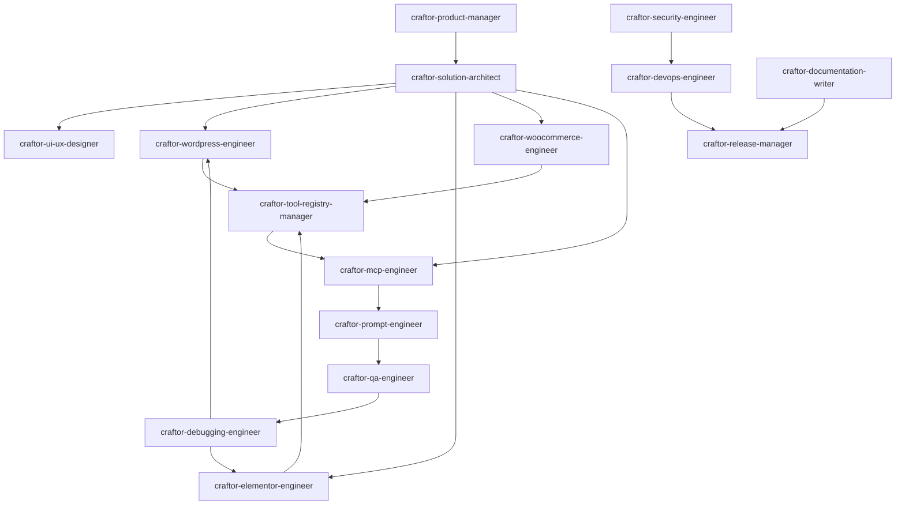

# Craftor — AI Skill Factory Roadmap & Architecture

**Document ID:** SKILL-ROADMAP-2026-001  
**Project:** Craftor — Universal MCP Platform for WordPress & Elementor  
**Version:** 1.0.0  
**Target Environment:** Antigravity AI Agent Customization System (`.agents/skills/`)

---

## 1. Skill Factory Vision & Architecture

The Craftor AI Skill Factory establishes a complete, production-ready, multi-agent skill ecosystem for autonomous and human-in-the-loop engineering. Every skill is an autonomous cognitive module packaged with YAML frontmatter, deterministic workflows, inputs/outputs, schemas, example prompts, operational resources, and execution scripts.

```
                               ┌──────────────────────────────────────────────┐
                               │           CRAFTOR SKILL ECOSYSTEM            │
                               └──────────────────────┬───────────────────────┘
                                                      │
         ┌───────────────────────────┬────────────────┴──────────────────────────┬───────────────────────────┐
         │                           │                                           │                           │
┌────────▼────────┐         ┌────────▼────────┐                         ┌────────▼────────┐         ┌────────▼────────┐
│  1. STRATEGY &  │         │  2. CORE ENGINE │                         │   3. PROTOCOL   │         │ 4. QUALITY, SEC │
│   ARCHITECTURE  │         │   ENGINEERING   │                         │  & REGISTRY OPS │         │   & RELEASE OPS │
├─────────────────┤         ├─────────────────┤                         ├─────────────────┤         ├─────────────────┤
│• product-manager│         │• wordpress-eng  │                         │• mcp-engineer   │         │• qa-engineer    │
│• solution-arch  │         │• elementor-eng  │                         │• tool-registry  │         │• debugging-eng  │
│• ui-ux-designer │         │• woocommerce-eng│                         │• prompt-engineer│         │• devops-engineer│
└─────────────────┘         └─────────────────┘                         └─────────────────┘         │• security-eng   │
                                                                                                    │• doc-writer     │
                                                                                                    │• release-manager│
                                                                                                    └─────────────────┘
```

---

## 2. Standardized Skill Anatomy & Folder Structure

Every skill is strictly encapsulated in its dedicated directory under `.agents/skills/<skill-slug>/`:

```
.agents/skills/<skill-slug>/
├── SKILL.md                 # Master instructions with YAML frontmatter (name, description)
├── examples/                # Realistic input/output scenarios, conversation transcripts, AST examples
│   ├── basic-example.md
│   └── advanced-example.md
├── resources/               # JSON schemas, reference templates, capability checklists, style tokens
│   ├── schema.json
│   └── checklist.md
└── scripts/                 # Deterministic verification, validation, and analysis scripts (Node/Python/Bash)
    └── validate.js (or .py / .sh)
```

### Mandatory Sections in Every `SKILL.md`:

1. **YAML Frontmatter** (`name`, `description`)
2. **Mission & Identity**
3. **Core Responsibilities**
4. **Required Expertise & Competency Matrix**
5. **Inputs & Contextual Triggers**
6. **Outputs & State Changes**
7. **Deterministic Step-by-Step Workflow**
8. **Operational Rules & Invariants** (Strict DOs and DON'Ts)
9. **Deliverables & Artifact Schemas**
10. **Acceptance Criteria & Quality Gateways**
11. **Best Practices & Golden Rules**
12. **Common Anti-Patterns & Pitfalls to Avoid**
13. **Required Tools & Transports**
14. **Production Examples (Few-Shot Prompt/Execution Pairs)**
15. **Quality Standards & Verification Assertions**

---

## 3. The 15 Specialized Craftor Skills Taxonomy

|   #    | Skill Slug                      | Primary Domain         | Core Mission                                                               | Key Handoff Partner       |
| :----: | :------------------------------ | :--------------------- | :------------------------------------------------------------------------- | :------------------------ |
| **01** | `craftor-product-manager`       | Product Strategy       | Own PRDs, user stories, MCP tool priorities & client roadmaps.             | Solution Architect        |
| **02** | `craftor-solution-architect`    | System Architecture    | Design system topology, JSON-RPC schemas, transaction models & ADRs.       | All Engineering Skills    |
| **03** | `craftor-ui-ux-designer`        | Design & UI Systems    | Design WP Admin UI, Elementor Canvas overlays, visual diff viewers.        | WordPress & Elementor Eng |
| **04** | `craftor-wordpress-engineer`    | WP Core Backend        | Build WP REST API bridge, CPTs, taxonomies, `$wpdb` snapshots & hooks.     | MCP & Elementor Eng       |
| **05** | `craftor-elementor-engineer`    | Elementor AST Engine   | Master Elementor Flexbox/Grid AST, widgets, dynamic tags & canvas sync.    | MCP & Prompt Eng          |
| **06** | `craftor-mcp-engineer`          | Protocol & Transports  | Implement MCP JSON-RPC server daemon (`stdio`, `SSE`), client adapters.    | Tool Registry & Devs      |
| **07** | `craftor-tool-registry-manager` | Tool Orchestration     | Maintain, categorize, validate & index 240+ atomic & compound MCP tools.   | MCP & Prompt Eng          |
| **08** | `craftor-woocommerce-engineer`  | E-Commerce Engine      | Build catalog, variation, inventory, order & checkout automation tools.    | Elementor & MCP Eng       |
| **09** | `craftor-qa-engineer`           | E2E & Verification     | Build Playwright, PHPUnit, and visual regression test harnesses.           | Debugging & Release Eng   |
| **10** | `craftor-debugging-engineer`    | Triage & Root Cause    | Trace JSON-RPC drops, fatal PHP halts, AST corruptions & fix regressions.  | WP & Elementor Eng        |
| **11** | `craftor-devops-engineer`       | CI/CD & Infrastructure | Maintain GitHub Actions, Docker test matrices, staging grids & builds.     | Security & Release Eng    |
| **12** | `craftor-security-engineer`     | Zero-Trust & Hardening | Enforce AES-256 token vaults, prompt injection shields, capability checks. | DevOps & WP Eng           |
| **13** | `craftor-documentation-writer`  | Technical Docs & DX    | Author 5-min client setup guides, 240-tool API catalog, troubleshooting.   | All Skills                |
| **14** | `craftor-prompt-engineer`       | System Prompts & Evals | Author tool descriptions, layout system prompts & Promptfoo eval suites.   | Tool Registry & MCP Eng   |
| **15** | `craftor-release-manager`       | Release Orchestration  | Gatekeep stage gates, manage OTA update distribution & release packages.   | QA, DevOps & Docs         |

---

## 4. Execution & Generation Roadmap (5 Strategic Batches)

```
┌──────────────────────────────────────────────────────────────────────────────────────────────────┐
│                                 5-BATCH SKILL GENERATION SEQUENCE                                │
├──────────────────────────┬───────────────────────────────────────────────────────────────────────┤
│ Batch 1: Strategy &      │ 1. `craftor-product-manager`                                          │
│ Architecture             │ 2. `craftor-solution-architect`                                        │
│                          │ 3. `craftor-ui-ux-designer`                                           │
├──────────────────────────┼───────────────────────────────────────────────────────────────────────┤
│ Batch 2: Core Platform   │ 4. `craftor-wordpress-engineer`                                       │
│ & Builder Engines        │ 5. `craftor-elementor-engineer`                                       │
│                          │ 6. `craftor-woocommerce-engineer`                                     │
├──────────────────────────┼───────────────────────────────────────────────────────────────────────┤
│ Batch 3: Protocol,       │ 7. `craftor-mcp-engineer`                                             │
│ Tool Registry & Prompts  │ 8. `craftor-tool-registry-manager`                                    │
│                          │ 9. `craftor-prompt-engineer`                                          │
├──────────────────────────┼───────────────────────────────────────────────────────────────────────┤
│ Batch 4: Quality,        │ 10. `craftor-qa-engineer`                                             │
│ Debugging & Verification │ 11. `craftor-debugging-engineer`                                      │
├──────────────────────────┼───────────────────────────────────────────────────────────────────────┤
│ Batch 5: DevOps,         │ 12. `craftor-devops-engineer`                                         │
│ Security, Docs & Release │ 13. `craftor-security-engineer`                                       │
│                          │ 14. `craftor-documentation-writer`                                    │
│                          │ 15. `craftor-release-manager`                                         │
└──────────────────────────┴───────────────────────────────────────────────────────────────────────┘
```

---

## 5. Skill Interoperability & Communication Graph



---

## 6. Verification and Validation Rules

Before any skill is considered production-ready:

1. **Frontmatter Validation:** Every `SKILL.md` must include valid YAML frontmatter with accurate `name` and descriptive `description`.
2. **Completeness Check:** All 16 mandatory sections must be fully written with zero placeholder strings (e.g., no `TBD`, `TODO`, `lorem ipsum`).
3. **Directory Verification:** Associated `examples/`, `resources/`, and `scripts/` directories must exist with concrete production-grade reference files.
4. **Tool Compatibility:** Every skill must be immediately executable by Antigravity and compatible with Claude, Cursor, and OpenAI tool-calling runtimes.
