# Craftor — Skills Ecosystem Audit, Optimization & Team Collaboration Workflow

**Document ID:** AUD-2026-001  
**Project:** Craftor (Universal MCP Platform for WordPress, Elementor & WooCommerce)  
**Version:** 1.0.0 (Optimized Baseline)  
**Target Environment:** Antigravity AI Agent Customization System (`.agents/skills/`)

---

## 1. Executive Audit Summary

A rigorous structural and operational audit of the 15 Craftor skills was conducted to identify:

1. **Functional Overlaps & Duplicated Responsibilities**
2. **Missing Capabilities & Edge-Case Blindspots**
3. **Dependency Conflicts & Blocking Race Conditions**
4. **Workflow & Handoff Gaps**

This document establishes the **Optimized Skills Taxonomy**, the **Definitive RACI & Boundary Contracts**, and the **End-to-End Multi-Agent Collaboration Workflow**.

```
┌──────────────────────────────────────────────────────────────────────────────────────────────────┐
│                                    CRAFTOR SKILL AUDIT & RESOLUTION                              │
├──────────────────────┬────────────────────────────────────────┬──────────────────────────────────┤
│ Identified Friction  │ Root Cause                             │ Optimized Architectural Remedy   │
├──────────────────────┼────────────────────────────────────────┼──────────────────────────────────┤
│ 1. Tool Schema       │ Overlap between SA, Tool Registry,     │ • SA: Meta-schemas & RPC specs.  │
│    Ownership         │ WP/EL/Woo Engineers, and MCP Eng.      │ • Tool Registry: SSOT for JSON   │
│                      │                                        │   schemas & catalog indexing.    │
│                      │                                        │ • Domain Eng: PHP controllers.   │
│                      │                                        │ • MCP Eng: Transport dispatch.   │
├──────────────────────┼────────────────────────────────────────┼──────────────────────────────────┤
│ 2. Prompt Text vs    │ Ambiguity between Prompt Engineer,     │ • Tool Registry: Structural types│
│    Tool Docstrings   │ Documentation Writer, and Registry.    │ • Prompt Eng: LLM docstrings &   │
│                      │                                        │   reasoning system prompts.      │
│                      │                                        │ • Doc Writer: Human docs/tables. │
├──────────────────────┼────────────────────────────────────────┼──────────────────────────────────┤
│ 3. Build Packaging   │ Boundary overlap between DevOps        │ • DevOps: Packaging scripts,     │
│    vs Release Gate   │ Engineer and Release Manager.          │   Docker runners, CI automation. │
│                      │                                        │ • Release Mgr: 5 Stage Gates,    │
│                      │                                        │   SemVer, OTA canary flags.      │
├──────────────────────┼────────────────────────────────────────┼──────────────────────────────────┤
│ 4. Dual AI Modes     │ Missing explicit ownership of BYOK vs  │ • Security: AES-256 Key Vault.   │
│    (BYOK / Managed)  │ Managed AI credit gateway logic.       │ • MCP Eng: Local vs Cloud router.│
│                      │                                        │ • SA: Multi-tenant gateway spec. │
├──────────────────────┼────────────────────────────────────────┼──────────────────────────────────┤
│ 5. Visual Diff &     │ Unclear contract between UI/UX tokens, │ • UI/UX: Diff visual specs.      │
│    Live Canvas Sync  │ Elementor JS bridge, and QA Baselines. │ • EL Eng: Canvas postMessage bus.│
│                      │                                        │ • QA: Pixelmatch automated diff. │
└──────────────────────┴────────────────────────┴──────────────────────────────────┘
```

---

## 2. In-Depth Boundary Disambiguation

### 2.1 Tool Schema Disambiguation Contract

To prevent duplicated or conflicting tool signatures across the 240-tool catalog:

```
┌────────────────────────────────────────────────────────────────────────────────────────┐
│                               TOOL DEFINITION LIFECYCLE                                │
├──────────────────────────┬──────────────────────────┬──────────────────────────────────┤
│ DOMAIN ENGINEERS         │ TOOL REGISTRY MANAGER    │ PROMPT ENGINEER                  │
│ (WP / Elementor / Woo)   │ (Single Source of Truth) │ (LLM Context Optimization)       │
├──────────────────────────┼──────────────────────────┼──────────────────────────────────┤
│ Implements backend       │ Registers tool in        │ Optimizes parameter descriptions │
│ execution handler in PHP │ master registry JSON     │ and writes system prompts        │
│ (`includes/Controllers/`)│ with strict JSON Schema  │ for >98.5% LLM reasoning fidelity│
└────────────┬─────────────┴────────────┬─────────────┴────────────────┬─────────────────┘
             │                          │                              │
             └──────────────────────────┼──────────────────────────────┘
                                        │
                         ┌──────────────▼──────────────┐
                         │      MCP PROTOCOL ENGINE    │
                         │ (Runtime Transport Dispatch)│
                         └─────────────────────────────┘
```

1. **Solution Architect:** Owns the global schema standards, error code mapping (`-32602`, etc.), and protocol envelopes.
2. **Domain Engineers (WordPress, Elementor, WooCommerce):** Implement the PHP endpoint logic and sanitize inputs/outputs.
3. **Tool Registry Manager (SSOT):** Owns `resources/master-tool-registry.json`. No tool can be exposed over MCP without passing through this registry.
4. **Prompt Engineer:** Enhances the tool descriptions and parameter docstrings inside the registry to maximize LLM zero-shot reasoning.
5. **MCP Engineer:** Binds the compiled registry to runtime JSON-RPC `tools/list` and `tools/call` transport handlers.

---

### 2.2 Dual AI Mode Responsibility Matrix (BYOK vs Managed Cloud)

- **Mode 1: Bring Your Own API Key (BYOK)**
  - _Security Engineer:_ Enforces local AES-256 encryption in `wp_options` using site salts; ensures zero plaintext key leaks.
  - _WordPress Engineer:_ Implements the settings UI key storage and verification callback.
  - _MCP Engineer:_ Routes LLM requests locally via the client's direct API endpoint.
- **Mode 2: Managed AI Services (Cloud Gateway)**
  - _Solution Architect:_ Designs the secure cloud proxy handshake, quota tokens, and failover routing protocol.
  - _DevOps & Security:_ Hardens the SaaS API gateway, manages rate limits, and protects against tenant cross-contamination.
  - _Product Manager:_ Monitors usage metrics, token credit balances, and subscription tiers.

---

## 3. Final Optimized Skills Matrix (15 Skills)

```
┌─────────────────────────────────────────────────────────────────────────────────────────────────────────┐
│                                   CRAFTOR FINAL OPTIMIZED SKILLS MATRIX                                 │
├────┬───────────────────────────────┬───────────────────────────────┬──────────────────────────────────┤
│ #  │ Skill Slug                    │ Strict Domain Scope           │ Primary Input ──► Primary Output │
├────┼───────────────────────────────┼───────────────────────────────┼──────────────────────────────────┤
│ 01 │ `craftor-product-manager`     │ PRDs, Personas, Roadmaps,     │ User Feedback ──► PRDs, User     │
│    │                               │ Acceptance Criteria, MoSCoW   │ Stories (Gherkin), KPI Specs     │
├────┼───────────────────────────────┼───────────────────────────────┼──────────────────────────────────┤
│ 02 │ `craftor-solution-architect`  │ System Topology, ADRs,        │ PRDs, Security Directives ──►    │
│    │                               │ JSON-RPC Specs, State Models  │ ADRs, System Architecture, Specs │
├────┼───────────────────────────────┼───────────────────────────────┼──────────────────────────────────┤
│ 03 │ `craftor-ui-ux-designer`      │ Admin UI, Canvas Overlays,    │ User Journeys ──► Design Tokens, │
│    │                               │ Visual Diff UX, WCAG 2.1 AA   │ Screen Mockups, Diff Viewer Spec │
├────┼───────────────────────────────┼───────────────────────────────┼──────────────────────────────────┤
│ 04 │ `craftor-wordpress-engineer`  │ WP REST Bridge, CPTs, Meta,   │ Schemas ──► PHP Plugin Classes,  │
│    │                               │ Snapshots, WPCS, WP-CLI       │ REST Endpoints, Snapshot Engine  │
├────┼───────────────────────────────┼───────────────────────────────┼──────────────────────────────────┤
│ 05 │ `craftor-elementor-engineer`  │ Flex/Grid AST, Widget Tree,   │ AST Models ──► AST Parser, CSS   │
│    │                               │ Global Kits, Canvas Live-Sync │ Cache Purge, Canvas JS Bridge    │
├────┼───────────────────────────────┼───────────────────────────────┼──────────────────────────────────┤
│ 06 │ `craftor-woocommerce-engineer`│ Products, Variants, Inventory,│ Woo Stories ──► Woo Controllers, │
│    │                               │ Orders, Coupons, Woo AST      │ CRUD Handlers, E-Commerce AST    │
├────┼───────────────────────────────┼───────────────────────────────┼──────────────────────────────────┤
│ 07 │ `craftor-tool-registry-manager`│ 240+ Tool Catalog, Taxonomy, │ Tool Specs ──► Master Registry   │
│    │                               │ Dynamic Tool Filter, SSOT     │ Manifest, Filter Algorithms      │
├────┼───────────────────────────────┼───────────────────────────────┼──────────────────────────────────┤
│ 08 │ `craftor-mcp-engineer`        │ stdio/SSE Daemon, JSON-RPC,   │ Registry, ADRs ──► MCP Server    │
│    │                               │ Client Adapters (8x AI IDEs)  │ Binary, Client Config Presets    │
├────┼───────────────────────────────┼───────────────────────────────┼──────────────────────────────────┤
│ 09 │ `craftor-prompt-engineer`     │ Tool Docstrings, System       │ Registry Schemas ──► System      │
│    │                               │ Prompts, Prompt Evals (>98.5%)│ Prompts, Promptfoo Benchmarks    │
├────┼───────────────────────────────┼───────────────────────────────┼──────────────────────────────────┤
│ 10 │ `craftor-qa-engineer`         │ E2E Playwright, PHPUnit,      │ Builds, Acceptance Criteria ──►  │
│    │                               │ Visual Regression, Mock Suite │ E2E Suites, QA Certifications    │
├────┼───────────────────────────────┼───────────────────────────────┼──────────────────────────────────┤
│ 11 │ `craftor-debugging-engineer`  │ Protocol Trace Triage, MREs,  │ Bug Reports, Crash Dumps ──►     │
│    │                               │ Fatal Error Root Cause, RCAs  │ RCAs, MREs, Hotfix Assertions    │
├────┼───────────────────────────────┼───────────────────────────────┼──────────────────────────────────┤
│ 12 │ `craftor-devops-engineer`     │ GitHub Actions, Docker Grids, │ Source Code ──► CI/CD Pipelines, │
│    │                               │ Packaging, SHA-256 Checksums  │ Docker Compose, Release Bundles  │
├────┼───────────────────────────────┼───────────────────────────────┼──────────────────────────────────┤
│ 13 │ `craftor-security-engineer`   │ Zero-Trust, AES-256 Vaults,   │ Endpoints, Payloads ──► Security │
│    │                               │ Prompt Shields, OWASP Audits  │ Policies, SAST Scans, Token Auth │
├────┼───────────────────────────────┼───────────────────────────────┼──────────────────────────────────┤
│ 14 │ `craftor-documentation-writer`│ 5-Min Quickstarts, 240-Tool   │ Registry, Releases ──► Developer │
│    │                               │ API Docs, Troubleshooting DX  │ Portals, Client Connection Docs  │
├────┼───────────────────────────────┼───────────────────────────────┼──────────────────────────────────┤
│ 15 │ `craftor-release-manager`     │ 5 Stage Gates, SemVer Tagging,│ QA/Sec Certs ──► Signed Release  │
│    │                               │ OTA Distribution, Canary Roll │ Packages, Changelogs, OTA Flags  │
└────┴───────────────────────────────┴───────────────────────────────┴──────────────────────────────────┘
```

---

## 4. End-to-End Team Collaboration Workflow

The multi-agent collaboration workflow is governed by 5 sequential execution phases with explicit hand-off contracts and automated verification feedback loops:

```mermaid
sequenceDiagram
    autonumber
    actor User as Product / User Need
    participant PM as craftor-product-manager
    participant SA as craftor-solution-architect
    participant UI as craftor-ui-ux-designer
    participant ENG as Domain Engineers (WP / EL / WOO)
    participant REG as craftor-tool-registry-manager
    participant MCP as craftor-mcp-engineer
    participant PRM as craftor-prompt-engineer
    participant QA as craftor-qa-engineer
    participant DBG as craftor-debugging-engineer
    participant SEC as craftor-security-engineer
    participant DEV as craftor-devops-engineer
    participant DOC as craftor-documentation-writer
    participant REL as craftor-release-manager

    %% Phase 1: Specification & Invariants
    rect rgb(30, 41, 59)
    note right of PM: PHASE 1: SPECIFICATION & ARCHITECTURE
    User->>PM: Feature Need / User Story
    PM->>PM: Drafts PRD with Gherkin Acceptance Criteria
    PM->>SA: Submits PRD for Architectural Feasibility
    SA->>SA: Formulates ADR & JSON-RPC Schemas
    SA->>UI: Defines Data Model Boundaries
    UI->>UI: Produces Design Tokens & Screen Mockups
    SA->>PM: Stage Gate 1 Sign-Off (Specs & Schemas Approved)
    end

    %% Phase 2: Engine & Protocol Implementation
    rect rgb(15, 23, 42)
    note right of ENG: PHASE 2: IMPLEMENTATION & TOOL REGISTRATION
    SA->>ENG: Dispatches Schemas & Controller Contracts
    ENG->>ENG: Develops PHP Controllers, AST Parsers & Snapshots
    ENG->>REG: Submits New Tool Signatures
    REG->>REG: Indexes Tools into Master 240+ Catalog & Filters
    REG->>MCP: Exports Compiled Tool Registry
    MCP->>MCP: Builds stdio & SSE Transports with Adapters
    REG->>PRM: Hands off Schema Parameter Definitions
    PRM->>PRM: Tunes LLM Docstrings & Layout System Prompts
    end

    %% Phase 3: Verification, Evals & Hardening
    rect rgb(30, 41, 59)
    note right of QA: PHASE 3: QUALITY, EVALS & SECURITY AUDIT
    PRM->>QA: Submits System Prompts & Tool Docstrings
    ENG->>QA: Deploys Plugin Build to Docker Matrix
    MCP->>QA: Deploys MCP Server Build
    QA->>QA: Runs PHPUnit, Playwright E2E & Visual Regression
    PRM->>QA: Runs Automated Promptfoo Evals (>98.5% Pass)
    alt Bug Detected / Regressions Found
        QA->>DBG: Dispatches Trace Dumps & Logs
        DBG->>DBG: Generates MRE & Root Cause Analysis (RCA)
        DBG->>ENG: Delivers Patch & Regression Assertion
        ENG->>QA: Re-submits Corrected Build
    end
    SEC->>SEC: Runs SAST/DAST, Token Vault & SSRF Audits
    QA->>REL: Issues QA Test Certification
    SEC->>REL: Issues Security Sign-Off Certificate
    end

    %% Phase 4: Documentation & Packaging
    rect rgb(15, 23, 42)
    note right of DOC: PHASE 4: DOCUMENTATION & PACKAGING
    REG->>DOC: Provides Master Tool Registry JSON
    DOC->>DOC: Generates 240-Tool Reference & Client Quickstarts
    DEV->>DEV: Runs GitHub Actions Pipeline, Packages Release & Calculates SHA-256
    DEV->>REL: Delivers Verified Release Bundle & Manifest
    DOC->>REL: Delivers Approved Release Changelog
    end

    %% Phase 5: Release Gating & OTA Distribution
    rect rgb(30, 41, 59)
    note right of REL: PHASE 5: STAGE GATE 5 & DISTRIBUTION
    REL->>REL: Validates all 5 Stage Gates
    REL->>REL: Tags Git SemVer & Enables Canary OTA (1% -> 10% -> 100%)
    REL-->>User: General Availability Public Release Live
    end
```



---

## 5. Stage Gate Quality Checkpoints & Blocking Rules

```
[GATE 1: SPECIFICATION] ──► Blocked if PRD lacks Gherkin criteria or ADR is unapproved.
         │
[GATE 2: IMPLEMENTATION] ─► Blocked if tool fails lowercase snake_case schema naming.
         │
[GATE 3: CONFORMANCE] ───► Blocked if MCP Inspector fails or PHPCS has 1+ error.
         │
[GATE 4: EVALS & AUDIT] ──► Blocked if Prompt Evals <98.5% or SAST reports 1+ High CVE.
         │
[GATE 5: DISTRIBUTION] ───► Blocked if SHA-256 checksum mismatches or OTA canary fails.
```

### Gate Breakdown & Thresholds:

1. **Gate 1 (Spec & Architecture):** Sign-off by `craftor-product-manager` + `craftor-solution-architect`.
2. **Gate 2 (Registry & Platform Integration):** Sign-off by `craftor-tool-registry-manager` + Domain Leads (`craftor-wordpress-engineer`, `craftor-elementor-engineer`).
3. **Gate 3 (Protocol Conformance):** Sign-off by `craftor-mcp-engineer` (100% pass on official MCP inspector).
4. **Gate 4 (Evals, Quality & Security):** Sign-off by `craftor-prompt-engineer` ($\ge 98.5\%$ first-pass accuracy) + `craftor-qa-engineer` (zero regressions, visual diff $<0.01\%$) + `craftor-security-engineer` (zero high/critical CVEs).
5. **Gate 5 (Release & OTA):** Final sign-off by `craftor-release-manager`.

---

## 6. Feedback & Exception Recovery Pathways

When exceptions occur during execution, strict automated feedback loops redirect tasks to the designated remediation skill:

- **Path A — LLM Tool Hallucination / Selection Failure:**
  - _Trigger:_ Promptfoo eval score drops below $98.5\%$ or model calls non-existent parameters.
  - _Action:_ `craftor-prompt-engineer` refines the tool docstring, parameter descriptions, and few-shot examples; re-evaluates until threshold is satisfied.
- **Path B — Elementor AST Layout Corruption:**
  - _Trigger:_ Elementor canvas throws "Invalid Data" or CSS cache fails to regenerate.
  - _Action:_ `craftor-debugging-engineer` captures the raw JSON payload $\rightarrow$ isolates missing default control properties $\rightarrow$ `craftor-elementor-engineer` updates `AstParser.php`.
- **Path C — Security / Capability Breach:**
  - _Trigger:_ SAST/DAST detects unescaped query or missing permission check.
  - _Action:_ Pipeline halts immediately; `craftor-security-engineer` drafts mitigation patch $\rightarrow$ `craftor-wordpress-engineer` applies strict capability verification.
- **Path D — High Canary Rollout Error Rate:**
  - _Trigger:_ Error rate exceeds $0.05\%$ during 1% OTA canary deployment.
  - _Action:_ `craftor-release-manager` automatically rolls back OTA flag to previous stable release $\rightarrow$ `craftor-debugging-engineer` conducts post-mortem.

---

_This optimization model guarantees deterministic collaboration, strict boundary isolation, and maximum engineering velocity across the entire Craftor multi-agent development lifecycle._
