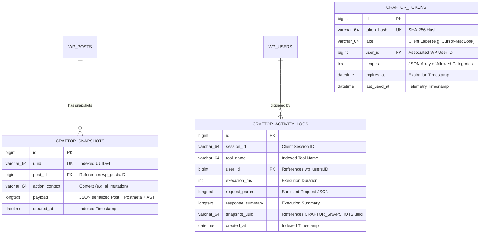

# Craftor — Complete System Architecture Specification

**Document ID:** ARCH-SPEC-2026-001  
**Project Name:** Craftor  
**Product Scope:** Universal Model Context Protocol (MCP) Platform for WordPress, Elementor & WooCommerce  
**Version:** 2.0.0 (Master Optimized Architecture)  
**Status:** Approved for Engineering Implementation  

---

## Table of Contents

1. [High-Level System Architecture](#1-high-level-system-architecture)
2. [The 4-Registry Universal Foundation](#2-the-4-registry-universal-foundation)
3. [Monorepo Architecture](#3-monorepo-architecture)
4. [MCP Server & AI Client Adapters Architecture](#4-mcp-server--ai-client-adapters-architecture)
5. [Tool Registry & Versioning Architecture](#5-tool-registry--versioning-architecture)
6. [3-Tier WordPress Plugin Architecture](#6-3-tier-wordpress-plugin-architecture)
7. [Decoupled Elementor Engine Architecture](#7-decoupled-elementor-engine-architecture)
8. [WooCommerce Engine Architecture](#8-woocommerce-engine-architecture)
9. [SaaS Dashboard & AI Marketplace Architecture](#9-saas-dashboard--ai-marketplace-architecture)
10. [Authentication & Zero-Trust Architecture](#10-authentication--zero-trust-architecture)
11. [Database Architecture (MySQL & PostgreSQL)](#11-database-architecture-mysql--postgresql)
12. [API Architecture (REST & JSON-RPC 2.0)](#12-api-architecture-rest--json-rpc-20)
13. [Security Architecture (STRIDE & Shields)](#13-security-architecture-stride--shields)
14. [Logging & Telemetry Architecture](#14-logging--telemetry-architecture)
15. [Testing & Quality Architecture](#15-testing--quality-architecture)
16. [CI/CD & OTA Distribution Architecture](#16-cicd--ota-distribution-architecture)
17. [Complete Service Dependency Map](#17-complete-service-dependency-map)

---

## 1. High-Level System Architecture

Craftor bridges external AI reasoning runtimes with WordPress and Elementor execution environments through a decoupled, multi-tier distributed architecture:

```
┌────────────────────────────────────────────────────────────────────────────────────────────────────────┐
│                                       1. AI CLIENT ECOSYSTEM LAYER                                     │
├─────────────────┬──────────────────┬─────────────────┬─────────────────┬───────────────┬───────────────┤
│ Claude Desktop  │ Claude Code (CLI)│ Cursor IDE      │ Antigravity IDE │ VS Code Ext.  │ Codex / Custom│
└────────┬────────┴────────┬─────────┴────────┬────────┴────────┬────────┴───────┬───────┴───────┬───────┘
         │                 │                  │                 │                │               │
         ▼                 ▼                  ▼                 ▼                ▼               ▼
┌────────────────────────────────────────────────────────────────────────────────────────────────────────┐
│                                  2. MODULAR CLIENT ADAPTER LAYER                                       │
├─────────────────┬──────────────────┬─────────────────┬─────────────────┬───────────────┬───────────────┤
│ claude-adapter  │ cursor-adapter   │ antigravity-adp.│ codex-adapter   │ vscode-adapter│ openai-adapter│
└────────┬────────┴────────┬─────────┴────────┬────────┴────────┬────────┴───────┬───────┴───────┬───────┘
         │                 │                  │                 │                │               │
         ▼                 ▼                  ▼                 ▼                ▼               ▼
┌────────────────────────────────────────────────────────────────────────────────────────────────────────┐
│                              3. MODEL CONTEXT PROTOCOL (MCP) TRANSPORT LAYER                           │
├─────────────────────────────────────────────┬──────────────────────────────────────────────────────────┤
│ Local Stdio Stream Transport (stdin/stdout) │ Remote Server-Sent Events (SSE) / WebSocket Transport    │
└──────────────────────┬──────────────────────┴──────────────────────────┬───────────────────────────────┘
                       │                                                 │
                       ▼                                                 ▼
┌────────────────────────────────────────────────────────────────────────────────────────────────────────┐
│                                    4. CRAFTOR MCP SERVER DAEMON CORE                                   │
├──────────────────────────────┬───────────────────────────────┬─────────────────────────────────────────┤
│ • JSON-RPC 2.0 Engine        │ • Dynamic Tool Registry       │ • Semantic Tool Filter & Minifier       │
│ • Capability Negotiator      │ • Schema Validator (Draft-07) │ • Context Budget & Token Compressor     │
│ • Skill & Agent Registry Bus │ • Resource Provider Stream    │ • Outbound REST Dispatcher / Connection │
└──────────────────────────────┴──────────────┬────────────────┴─────────────────────────────────────────┘
                                              │
                      ┌───────────────────────┴───────────────────────┐
                      │                                               │
                      ▼                                               ▼
┌───────────────────────────────────────────────┐ ┌──────────────────────────────────────────────────────┐
│     5. 3-TIER WORDPRESS PLUGIN ECOSYSTEM      │ │            6. CRAFTOR SAAS CLOUD DASHBOARD           │
│   (craftor-core / pro / enterprise)           │ │                 (`app.craftor.ai`)                   │
├───────────────────────────────────────────────┤ ├──────────────────────────────────────────────────────┤
│ • REST API Bridge (`/wp-json/craftor/v1/*`)   │ │ • Multi-Site Network Orchestration Hub               │
│ • Zero-Trust Auth & Capability Guard          │ │ • Dual AI Gateway (Mode 1: BYOK / Mode 2: Managed)   │
│ • Micro-Snapshot & Rollback Transaction Engine│ │ • AI Agent & Skill Marketplace                       │
│ • WP-CLI Command Infrastructure               │ │ • Central Activity Audit Trail & Diff Visualizer     │
│ • Webhook & Cache Purge Router                │ │ • License Key Validation & Seat Management           │
│ • WPMU Enterprise Network Isolation           │ │ • Over-The-Air (OTA) Update Release Channel          │
└───────┬──────────────────────┬────────────────┘ └──────────────────────────────────────────────────────┘
        │                      │
        ▼                      ▼
┌────────────────────────────────┐ ┌───────────────────────────┐
│ DECOUPLED ELEMENTOR ENGINE (5) │ │    WOOCOMMERCE ENGINE     │
├────────────────────────────────┤ ├───────────────────────────┤
│ • Widget Engine                │ │ • Catalog & Variation Ops │
│ • Layout Engine (Flex/Grid)    │ │ • HPOS Order Automation   │
│ • Template Engine              │ │ • Inventory Balancing     │
│ • Global Style Engine          │ │ • Coupon Promotions       │
│ • CSS Compiler & Cache         │ │ • E-Commerce AST Funnels  │
└───────┬────────────────────────┘ └─────────┬─────────────────┘
        │                                    │
        ▼                                    ▼
┌──────────────────────────────────────────────────────────────┐
│                 7. PERSISTENCE & RUNTIME DOM                 │
├──────────────────────────────────────────────────────────────┤
│ • MySQL / MariaDB (`wp_posts`, `postmeta`, `craftor_*`)      │
│ • Active Elementor Editor Canvas (Marionette/Backbone)       │
│ • Redis / Transient Object Caches                            │
└──────────────────────────────────────────────────────────────┘
```

---

## 2. The 4-Registry Universal Foundation

Craftor's primary platform differentiator is the unified architecture of **4 First-Class Registries**:

```
Craftor Core Platform
├── 1. Tool Registry     # 240+ Versioned MCP tools (40 in MVP -> 100 -> 160 -> 240+)
├── 2. Skill Registry    # 15 Antigravity specialized domain skills, evals & few-shot packs
├── 3. Agent Registry    # Autonomous role-based agents (Design Agent, Dev Agent, Ops Agent)
└── 4. Workflow Registry # Declarative multi-step atomic chains (e.g. Flash Sale, CPT Migration)
```

---

## 3. Monorepo Architecture

Craftor uses `pnpm` and `Turborepo` with clean workspace isolation:

```
craftor/
├── apps/
│   ├── dashboard/              # Next.js 14 React SaaS Dashboard (app.craftor.ai)
│   ├── api-gateway/            # Cloud MCP SSE Gateway & Managed AI Proxy
│   └── docs/                   # VitePress Developer Documentation & API Catalog
├── packages/
│   ├── mcp-server/             # Universal MCP Server Daemon (Node/TypeScript)
│   ├── tool-registry/          # SSOT Tool Schema Registry & Taxonomy
│   ├── client-adapters/        # Dedicated AI client adapters:
│   │   ├── claude-adapter/
│   │   ├── cursor-adapter/
│   │   ├── antigravity-adapter/
│   │   ├── codex-adapter/
│   │   ├── vscode-adapter/
│   │   └── openai-adapter/
│   ├── ast-parser/             # TypeScript Elementor AST parser & validator
│   ├── design-tokens/          # Shared CSS/JS HSL design system tokens
│   └── tsconfig/               # Base TypeScript configurations
├── plugins/
│   ├── craftor-core/           # Free Tier: 40 Core MCP tools & Basic AST (WP.org)
│   ├── craftor-pro/            # Pro Tier: 160 Tools, Live Sync, WooCommerce & Themes
│   └── craftor-enterprise/     # Enterprise Tier: 240+ Tools, WPMU Multi-Site & White-Label
└── docs/                       # Specifications, PRDs, ADRs, and Architecture Blueprints
```

---

## 4. MCP Server & AI Client Adapters Architecture

The MCP Server provides pluggable client adapters for seamless compatibility:

```
┌────────────────────────────────────────────────────────────────────────────────────────┐
│                              CRAFTOR MCP SERVER DAEMON                                 │
├────────────────────────────────────────────────────────────────────────────────────────┤
│                                                                                        │
│   ┌────────────────────────────────────────────────────────────────────────────────┐   │
│   │                         AI Client Adapter Interface                            │   │
│   │  [Claude Adapter] [Cursor Adapter] [Antigravity Adapter] [OpenAI/Gemini Adp.]  │   │
│   └───────────────────────────────────────┬────────────────────────────────────────┘   │
│                                           │                                            │
│                 ┌─────────────────────────┴─────────────────────────┐                  │
│                 ▼                                                   ▼                  │
│   ┌───────────────────────────┐                       ┌───────────────────────────┐    │
│   │  stdio Transport Adapter  │                       │   SSE Transport Adapter   │    │
│   │ (process.stdin / stdout)  │                       │ (Express / Node HTTP/2)   │    │
│   └─────────────┬─────────────┘                       └─────────────┬─────────────┘    │
│                 │                                                   │                  │
│                 └─────────────────────┬─────────────────────────────┘                  │
│                                       │                                                │
│                                       ▼                                                │
│                 ┌───────────────────────────────────────────┐                          │
│                 │      JSON-RPC 2.0 Connection Router       │                          │
│                 │   (Framing, ID Matcher, Error Envelopes)  │                          │
│                 └─────────────────────┬─────────────────────┘                          │
│                                       │                                                │
│                 ┌─────────────────────┴─────────────────────┐                          │
│                 │        4-Registry Dispatch Matrix         │                          │
│                 │ (Tools / Skills / Agents / Workflows)     │                          │
│                 └─────────────────────┬─────────────────────┘                          │
│                                       │                                                │
│                                       ▼                                                │
│                 ┌───────────────────────────────────────────┐                          │
│                 │       Outbound REST Bridge Client         │                          │
│                 │ (Keep-Alive HTTP/2 Agent, TLS Encryption) │                          │
│                 └───────────────────────────────────────────┘                          │
│                                                                                        │
└────────────────────────────────────────────────────────────────────────────────────────┘
```

---

## 5. Tool Registry & Versioning Architecture

### Staged 4-Phase Tool Rollout Matrix
* **Phase 1 (MVP Baseline):** 40 Essential Foundation Tools (Core WP CRUD, Basic Container AST, Hero/Pricing Compounds, Core Woo, Snapshots/Rollback).
* **Phase 2 (Pro & Live Sync):** 100 Tools (Advanced Flex/Grid, Global Kits, Full Woo Orders & Stock, Theme Templates).
* **Phase 3 (Advanced & Local Models):** 160 Tools (Woo Funnels, SEO/Schema JSON-LD, Media AI WebP, Dynamic Loop Grids).
* **Phase 4 (Enterprise Suite):** 240+ Complete Catalog (WPMU Multi-Site, White-Label SDK, Addon Discovery).

### Versioned Tool Schema Standard
Every tool implements the strictly typed metadata schema:
```json
{
  "id": "elementor_create_container",
  "version": "1.0.0",
  "category": "Elementor Canvas, Containers & Layouts",
  "permissions": ["edit_posts"],
  "inputs": { ... },
  "outputs": { ... },
  "deprecated": false
}
```

---

## 6. 3-Tier WordPress Plugin Architecture

```
plugins/
├── craftor-core/          # Open-Source (WP.org): Basic REST bridge, 40 core tools, 5-revision snapshots
├── craftor-pro/           # Commercial: 160 tools, Live Canvas sync, full WooCommerce, Global Kits, Visual Diff
└── craftor-enterprise/    # Enterprise: 240+ tools, WPMU Multi-Site, White-Label, AES-256 KMS, Addon SDK
```

---

## 7. Decoupled Elementor Engine Architecture

The Elementor engine is split into 5 distinct, decoupled sub-engines:

```
Elementor Engine/
├── 1. Widget Engine         # Registers and inspects widget controls and settings stacks
├── 2. Layout Engine         # Flexbox and CSS Grid container trees, directional flow and margins
├── 3. Template Engine       # Headers, Footers, Single Post, Archive, and Loop Grid templates
├── 4. Global Style Engine   # Global Colors, Global Typography, Theme Styles, and Breakpoints
└── 5. CSS Compiler          # Post-CSS cache compilation, minification, and cache flushing
```

---

## 8. WooCommerce Engine Architecture

* **HPOS Integration:** Full compatibility with WooCommerce High-Performance Order Storage tables.
* **Catalog & Variations:** Direct abstraction via `WC_Product_Variable` and `WC_Product_Variation`.
* **Dynamic E-Commerce AST:** Elementor Shop, Single Product, Cart, Checkout, and Upsell funnels.

---

## 9. SaaS Dashboard & AI Marketplace Architecture

```
Craftor SaaS Dashboard (app.craftor.ai)
├── Sites            # Connected WordPress instances (Single & WPMU Networks)
├── AI Providers     # BYOK Key Vault (OpenAI, Anthropic, Gemini, OpenRouter, Local)
├── MCP Servers      # Active local stdio daemons & cloud SSE instances
├── Tools            # Versioned tool catalog browser and permission scoping
├── Skills           # Marketplace of verified Antigravity skills & prompt packs
├── Agents           # Specialized AI Agent personas (e.g., Designer Agent, Dev Agent)
├── Billing          # Stripe subscription tiers, seats, and usage credits
├── Licenses         # Domain activations and cryptographic license token manager
├── Updates          # Over-The-Air (OTA) channel management (Stable, Beta, Canary)
└── Analytics        # Token usage charts, tool call frequency, latency benchmarks
```

---

## 10. Authentication & Zero-Trust Architecture

* **Zero-Trust Token Management:** Dynamic token generation with SHA-256 constant-time hashing (`hash_equals`).
* **WordPress Capability Mapping:** Enforces standard WP capabilities (`edit_posts`, `manage_options`, `manage_woocommerce`).
* **AES-256-GCM BYOK Vault:** Client API keys encrypted at rest with hardware/environment salts.

---

## 11. Database Architecture (MySQL & PostgreSQL)



---

## 12. API Architecture (REST & JSON-RPC 2.0)

| Method | Endpoint | Description | Scope / Permission |
| :--- | :--- | :--- | :--- |
| `POST` | `/auth/handshake` | Validates MCP token and returns site capabilities & versions. | `read` |
| `GET` | `/tools/schema` | Retrieves full JSON Schema catalog for active tools. | `read` |
| `POST` | `/tools/execute` | Primary batch/single tool dispatcher with snapshotting. | `edit_posts` / `manage_options` |
| `GET` | `/elementor/ast/{id}` | Retrieves parsed JSON AST for an Elementor document. | `edit_posts` |
| `POST` | `/elementor/mutate` | Mutates Elementor AST and triggers CSS cache purge. | `edit_posts` |
| `POST` | `/snapshots/{uuid}/restore` | Restores database state to a specific snapshot UUID. | `manage_options` |
| `GET` | `/snapshots/diff/{uuid}` | Generates JSON diff between current state and snapshot. | `edit_posts` |
| `POST` | `/woocommerce/mutate` | Executes WooCommerce product/order/stock mutations. | `manage_woocommerce` |

---

## 13. Security Architecture (STRIDE & Shields)

* **STRIDE Threat Modeling:** Full protection against Spoofing, Tampering, Repudiation, Information Disclosure, DoS, and Elevation of Privilege.
* **Prompt Injection Shield:** Neutralizes hostile prompt injections and prevents unauthorized file system access.
* **SSRF Protection:** Enforces strict public IP validation on media sideloading URLs to block local/metadata subnet access (`169.254.169.254`).

---

## 14. Logging & Telemetry Architecture

* **Dual-Tier Pipeline:**
  * Local WordPress 30-day rotating audit table (`wp_craftor_activity_logs`).
  * Centralized SaaS telemetry aggregation with automatic PII sanitization.

---

## 15. Testing & Quality Architecture

* **4-Tier Testing Pyramid:** Unit $\rightarrow$ Integration $\rightarrow$ E2E Playwright $\rightarrow$ Visual Regression (<0.01% diff) & Prompt Evals (>98.5%).
* **Deterministic Mock Harnesses:** Full protocol validation without live LLM billing dependencies.

---

## 16. CI/CD & OTA Distribution Architecture

* **GitHub Actions Workflows:** Multi-version PHP (7.4–8.3) and WordPress (6.0–6.5) test grids.
* **Progressive Canary Rollouts:** OTA auto-updates staged across Canary (1%) $\rightarrow$ Beta (10%) $\rightarrow$ General Availability (100%).

---

## 17. Complete Service Dependency Map

```
  [AI Client (Cursor/Claude)]
            │
            ▼
  [Client Adapter Layer] (packages/client-adapters/*)
            │
            ▼ (stdio / SSE)
  [MCP Server Daemon] ─────────────► [4-Registry Core] (Tools, Skills, Agents, Workflows)
            │                                  │
            │ (Schema Validation)              ▼
            ▼                        [@craftor/ast-parser]
  [Outbound REST Client]
            │
            ▼ (HTTPS JSON-RPC)
  [WordPress REST Bridge] ─────────► [SnapshotManager] ────────► [MySQL / $wpdb]
            │
            ├──────────────────────► [AuthMiddleware] ─────────► [AES-256 Key Vault]
            │
            ├──────────────────────► [Decoupled Elementor] ────► [Marionette Event Bus]
            │                        (Widget, Layout, Template,  │
            │                         Global Style, Compiler)    ▼
            │                                            [Post-CSS Cache]
            │
            └──────────────────────► [WooCommerceEngine] ──────► [HPOS Data Tables]
```

---

*This specification represents the official, optimized architectural standard for Craftor v2.0.*
