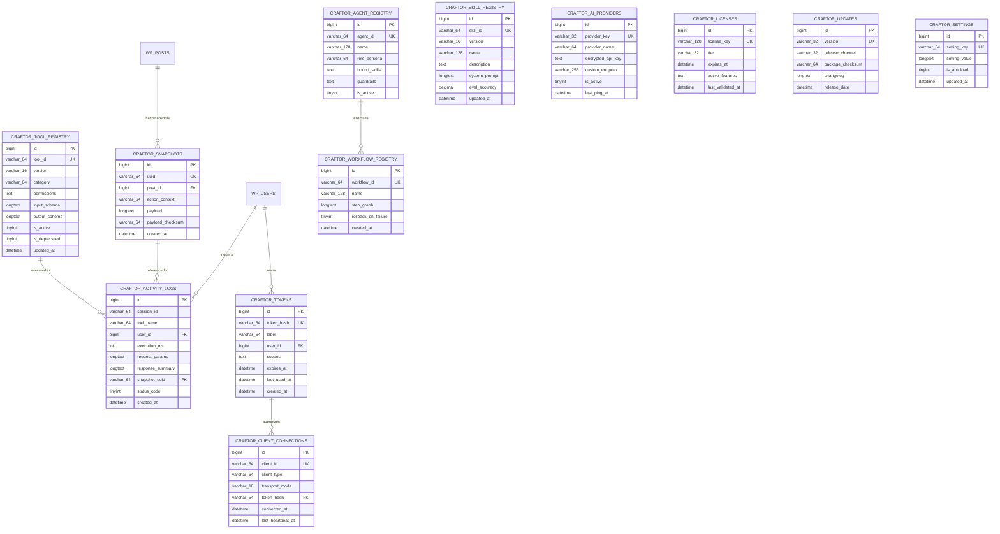
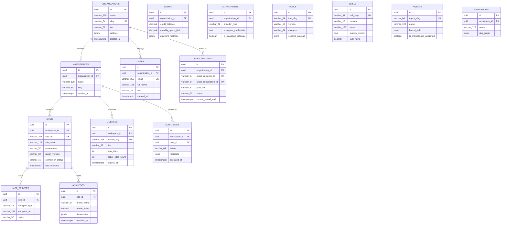

# Craftor — Complete Database Schema & Persistence Deep-Dive

**Document ID:** DB-SPEC-2026-001  
**Project:** Craftor — Universal MCP Platform for WordPress, Elementor & WooCommerce  
**Version:** 1.0.0 (Master Database Blueprint)  
**Status:** Approved for Monorepo & DDL Implementation  

---

## Executive Database Architecture Overview

Craftor operates on a **Decoupled Dual-Database Architecture**:
1. **The WordPress Local Persistence Layer (MySQL / MariaDB):** Stores local operational data, the 4 Local Registries, transactional snapshots, activity logs, client session tokens, and local encrypted BYOK keys directly within each WordPress instance (`$wpdb->prefix . 'craftor_*'`).
2. **The SaaS Control Plane Layer (PostgreSQL 16+):** Manages multi-tenant organizations, user seats, subscription billing, centralized AI gateway routing, global skill/agent marketplaces, high-volume telemetry, and cross-site audit logs.

```
┌────────────────────────────────────────────────────────────────────────────────────────────────────────┐
│                                   CRAFTOR DUAL-DATABASE ARCHITECTURE                                   │
├─────────────────────────────────────────────┬──────────────────────────────────────────────────────────┤
│ 1. WORDPRESS LOCAL DATABASE (MySQL 8.0+)    │ 2. SAAS CLOUD CONTROL PLANE (PostgreSQL 16+)             │
│    (Instance-Level Execution & Safety)      │    (Multi-Tenant Orchestration & Analytics)              │
├─────────────────────────────────────────────┼──────────────────────────────────────────────────────────┤
│ • `wp_craftor_snapshots`                    │ • `organizations` & `workspaces`                         │
│ • `wp_craftor_activity_logs`                │ • `users` & `subscriptions`                              │
│ • `wp_craftor_tokens`                       │ • `sites` & `licenses`                                   │
│ • `wp_craftor_tool_registry`                │ • `ai_providers` & `mcp_servers`                         │
│ • `wp_craftor_skill_registry`               │ • `tools`, `skills`, `agents`, `workflows` (Marketplace) │
│ • `wp_craftor_agent_registry`               │ • `analytics` (Timescale / Partitioned Monthly)          │
│ • `wp_craftor_workflow_registry`            │ • `audit_logs` (Partitioned Monthly & Append-Only)       │
│ • `wp_craftor_ai_providers`                 │                                                          │
│ • `wp_craftor_client_connections`           │                                                          │
│ • `wp_craftor_licenses`                     │                                                          │
│ • `wp_craftor_updates`                      │                                                          │
│ • `wp_craftor_settings`                     │                                                          │
└─────────────────────────────────────────────┴──────────────────────────────────────────────────────────┘
```

---

## PART 1: WordPress Local Database (MySQL / MariaDB)

All WordPress tables use the InnoDB storage engine, `utf8mb4_unicode_520_ci` collation, and dynamic table prefixing (`$wpdb->prefix . 'craftor_'`).

### 1.1 WordPress Entity-Relationship Diagram (ERD)



---

### 1.2 WordPress Core Tables Detailed Specifications

#### Table 1: `wp_craftor_snapshots`
* **Purpose:** Stores pre-mutation snapshots of `wp_posts`, `_elementor_data`, postmeta, and options for instant 1-click micro-rollback.
* **Columns & Schema:**
  * `id`: `BIGINT(20) UNSIGNED AUTO_INCREMENT PRIMARY KEY`
  * `uuid`: `VARCHAR(64) NOT NULL UNIQUE` (e.g. `snp_8f921a44c0`)
  * `post_id`: `BIGINT(20) UNSIGNED NOT NULL` (References `wp_posts.ID`)
  * `action_context`: `VARCHAR(64) NOT NULL` (e.g., `elementor_mutate`, `woo_flash_sale`)
  * `payload`: `LONGTEXT NOT NULL` (JSON-serialized snapshot payload)
  * `payload_checksum`: `VARCHAR(64) NOT NULL` (SHA-256 payload integrity hash)
  * `created_at`: `DATETIME NOT NULL DEFAULT CURRENT_TIMESTAMP`
* **Indexes:**
  * `PRIMARY KEY (id)`
  * `UNIQUE KEY idx_snapshot_uuid (uuid)`
  * `KEY idx_post_created (post_id, created_at)`
  * `KEY idx_created_at (created_at)`
* **Retention Policy:**
  * Free Core Tier: Maximum 5 snapshots per post ID; auto-pruned on 6th insertion.
  * Pro & Enterprise Tier: Unlimited snapshots for 90 days; auto-archived/pruned via WP-Cron.

#### Table 2: `wp_craftor_activity_logs`
* **Purpose:** Immutable audit trail recording every MCP tool execution, parameters, execution time, and snapshot reference.
* **Columns & Schema:**
  * `id`: `BIGINT(20) UNSIGNED AUTO_INCREMENT PRIMARY KEY`
  * `session_id`: `VARCHAR(64) NOT NULL` (Client session identifier)
  * `tool_name`: `VARCHAR(64) NOT NULL` (e.g., `elementor_create_container`)
  * `user_id`: `BIGINT(20) UNSIGNED NOT NULL DEFAULT 0` (References `wp_users.ID`)
  * `execution_ms`: `INT(10) UNSIGNED NOT NULL DEFAULT 0` (Execution latency in ms)
  * `request_params`: `LONGTEXT NULL` (Sanitized JSON input arguments)
  * `response_summary`: `LONGTEXT NULL` (Sanitized JSON output summary)
  * `snapshot_uuid`: `VARCHAR(64) NULL` (References `wp_craftor_snapshots.uuid`)
  * `status_code`: `TINYINT(3) UNSIGNED NOT NULL DEFAULT 200` (HTTP/JSON-RPC status)
  * `created_at`: `DATETIME NOT NULL DEFAULT CURRENT_TIMESTAMP`
* **Indexes:**
  * `PRIMARY KEY (id)`
  * `KEY idx_tool_created (tool_name, created_at)`
  * `KEY idx_session (session_id)`
  * `KEY idx_snapshot (snapshot_uuid)`
* **Retention Policy:** Rolling 30-day retention; rows older than 30 days purged daily via scheduled WP-Cron.

#### Table 3: `wp_craftor_tokens`
* **Purpose:** Stores cryptographically hashed bearer tokens used by AI clients (Cursor, Claude, Antigravity) to access the MCP server.
* **Columns & Schema:**
  * `id`: `BIGINT(20) UNSIGNED AUTO_INCREMENT PRIMARY KEY`
  * `token_hash`: `VARCHAR(64) NOT NULL UNIQUE` (SHA-256 hash of secret token)
  * `label`: `VARCHAR(64) NOT NULL` (Human-readable name, e.g. "Cursor MacBook Pro")
  * `user_id`: `BIGINT(20) UNSIGNED NOT NULL` (Associated WordPress User ID)
  * `scopes`: `TEXT NOT NULL` (JSON array of allowed tool categories, e.g. `["elementor", "posts"]`)
  * `expires_at`: `DATETIME NULL` (Optional expiration timestamp; NULL = perpetual)
  * `last_used_at`: `DATETIME NULL`
  * `created_at`: `DATETIME NOT NULL DEFAULT CURRENT_TIMESTAMP`
* **Indexes:**
  * `PRIMARY KEY (id)`
  * `UNIQUE KEY idx_token_hash (token_hash)`
  * `KEY idx_user_id (user_id)`

#### Table 4: `wp_craftor_tool_registry`
* **Purpose:** Local cache and state storage for all registered MCP tools, version numbers, capabilities, and active toggles.
* **Columns & Schema:**
  * `id`: `BIGINT(20) UNSIGNED AUTO_INCREMENT PRIMARY KEY`
  * `tool_id`: `VARCHAR(64) NOT NULL UNIQUE` (e.g., `elementor_create_container`)
  * `version`: `VARCHAR(16) NOT NULL DEFAULT '1.0.0'` (SemVer)
  * `category`: `VARCHAR(64) NOT NULL` (1 of 10 standard categories)
  * `permissions`: `TEXT NOT NULL` (JSON array of required WP capabilities, e.g. `["edit_posts"]`)
  * `input_schema`: `LONGTEXT NOT NULL` (JSON Schema Draft-07)
  * `output_schema`: `LONGTEXT NOT NULL` (JSON Schema Draft-07)
  * `is_active`: `TINYINT(1) NOT NULL DEFAULT 1`
  * `is_deprecated`: `TINYINT(1) NOT NULL DEFAULT 0`
  * `updated_at`: `DATETIME NOT NULL DEFAULT CURRENT_TIMESTAMP ON UPDATE CURRENT_TIMESTAMP`
* **Indexes:**
  * `PRIMARY KEY (id)`
  * `UNIQUE KEY idx_tool_id (tool_id)`
  * `KEY idx_category_active (category, is_active)`

#### Table 5: `wp_craftor_skill_registry`
* **Purpose:** Stores local Antigravity skills, system prompt instructions, benchmark eval ratings, and tool bindings.
* **Columns & Schema:**
  * `id`: `BIGINT(20) UNSIGNED AUTO_INCREMENT PRIMARY KEY`
  * `skill_id`: `VARCHAR(64) NOT NULL UNIQUE` (e.g., `craftor-elementor-engineer`)
  * `version`: `VARCHAR(16) NOT NULL DEFAULT '1.0.0'`
  * `name`: `VARCHAR(128) NOT NULL`
  * `description`: `TEXT NOT NULL`
  * `system_prompt`: `LONGTEXT NOT NULL` (Master prompt instructions)
  * `eval_accuracy`: `DECIMAL(5,2) NOT NULL DEFAULT 0.00` (e.g., 99.20%)
  * `updated_at`: `DATETIME NOT NULL DEFAULT CURRENT_TIMESTAMP ON UPDATE CURRENT_TIMESTAMP`
* **Indexes:**
  * `PRIMARY KEY (id)`
  * `UNIQUE KEY idx_skill_id (skill_id)`

#### Table 6: `wp_craftor_agent_registry`
* **Purpose:** Stores local AI Agent personas, scoped skills, and execution guardrails.
* **Columns & Schema:**
  * `id`: `BIGINT(20) UNSIGNED AUTO_INCREMENT PRIMARY KEY`
  * `agent_id`: `VARCHAR(64) NOT NULL UNIQUE` (e.g., `agent_visual_page_builder`)
  * `name`: `VARCHAR(128) NOT NULL`
  * `role_persona`: `VARCHAR(64) NOT NULL`
  * `bound_skills`: `TEXT NOT NULL` (JSON array of skill IDs)
  * `guardrails`: `TEXT NOT NULL` (JSON execution boundaries, e.g. `{"require_snapshot": true}`)
  * `is_active`: `TINYINT(1) NOT NULL DEFAULT 1`
* **Indexes:**
  * `PRIMARY KEY (id)`
  * `UNIQUE KEY idx_agent_id (agent_id)`

#### Table 7: `wp_craftor_workflow_registry`
* **Purpose:** Stores declarative multi-step atomic workflow graphs.
* **Columns & Schema:**
  * `id`: `BIGINT(20) UNSIGNED AUTO_INCREMENT PRIMARY KEY`
  * `workflow_id`: `VARCHAR(64) NOT NULL UNIQUE` (e.g., `wf_seasonal_flash_sale`)
  * `name`: `VARCHAR(128) NOT NULL`
  * `step_graph`: `LONGTEXT NOT NULL` (JSON representation of workflow nodes and edges)
  * `rollback_on_failure`: `TINYINT(1) NOT NULL DEFAULT 1`
  * `created_at`: `DATETIME NOT NULL DEFAULT CURRENT_TIMESTAMP`
* **Indexes:**
  * `PRIMARY KEY (id)`
  * `UNIQUE KEY idx_workflow_id (workflow_id)`

#### Table 8: `wp_craftor_ai_providers`
* **Purpose:** Stores local encrypted BYOK credentials for OpenAI, Anthropic, Gemini, OpenRouter, and local models.
* **Columns & Schema:**
  * `id`: `BIGINT(20) UNSIGNED AUTO_INCREMENT PRIMARY KEY`
  * `provider_key`: `VARCHAR(32) NOT NULL UNIQUE` (e.g., `anthropic`, `openai`, `gemini`, `local`)
  * `provider_name`: `VARCHAR(64) NOT NULL`
  * `encrypted_api_key`: `TEXT NULL` (AES-256-GCM encrypted key string)
  * `custom_endpoint`: `VARCHAR(255) NULL` (For Ollama / vLLM / LocalAI)
  * `is_active`: `TINYINT(1) NOT NULL DEFAULT 0`
  * `last_ping_at`: `DATETIME NULL`
* **Indexes:**
  * `PRIMARY KEY (id)`
  * `UNIQUE KEY idx_provider_key (provider_key)`

#### Table 9: `wp_craftor_client_connections`
* **Purpose:** Tracks active and historical AI client connection sessions (Cursor, Claude, Antigravity).
* **Columns & Schema:**
  * `id`: `BIGINT(20) UNSIGNED AUTO_INCREMENT PRIMARY KEY`
  * `client_id`: `VARCHAR(64) NOT NULL UNIQUE` (Client UUID)
  * `client_type`: `VARCHAR(64) NOT NULL` (e.g., `cursor`, `claude_desktop`, `vscode`)
  * `transport_mode`: `VARCHAR(16) NOT NULL` (`stdio` or `sse`)
  * `token_hash`: `VARCHAR(64) NOT NULL` (References `wp_craftor_tokens.token_hash`)
  * `connected_at`: `DATETIME NOT NULL DEFAULT CURRENT_TIMESTAMP`
  * `last_heartbeat_at`: `DATETIME NOT NULL DEFAULT CURRENT_TIMESTAMP`
* **Indexes:**
  * `PRIMARY KEY (id)`
  * `UNIQUE KEY idx_client_id (client_id)`
  * `KEY idx_heartbeat (last_heartbeat_at)`

#### Table 10: `wp_craftor_licenses`
* **Purpose:** Local validation cache for Craftor license entitlement and tier verification.
* **Columns & Schema:**
  * `id`: `BIGINT(20) UNSIGNED AUTO_INCREMENT PRIMARY KEY`
  * `license_key`: `VARCHAR(128) NOT NULL UNIQUE`
  * `tier`: `VARCHAR(32) NOT NULL DEFAULT 'core'` (`core`, `pro`, `enterprise`)
  * `expires_at`: `DATETIME NULL`
  * `active_features`: `TEXT NOT NULL` (JSON array of unlocked feature flags)
  * `last_validated_at`: `DATETIME NOT NULL DEFAULT CURRENT_TIMESTAMP`
* **Indexes:**
  * `PRIMARY KEY (id)`
  * `UNIQUE KEY idx_license_key (license_key)`

#### Table 11: `wp_craftor_updates`
* **Purpose:** Over-The-Air (OTA) update metadata cache and staged package verification records.
* **Columns & Schema:**
  * `id`: `BIGINT(20) UNSIGNED AUTO_INCREMENT PRIMARY KEY`
  * `version`: `VARCHAR(32) NOT NULL UNIQUE`
  * `release_channel`: `VARCHAR(32) NOT NULL DEFAULT 'stable'` (`stable`, `beta`, `canary`)
  * `package_checksum`: `VARCHAR(64) NOT NULL` (SHA-256)
  * `changelog`: `LONGTEXT NOT NULL`
  * `release_date`: `DATETIME NOT NULL`
* **Indexes:**
  * `PRIMARY KEY (id)`
  * `UNIQUE KEY idx_version (version)`

#### Table 12: `wp_craftor_settings`
* **Purpose:** Key-value configuration parameters for Craftor with autoload optimization.
* **Columns & Schema:**
  * `id`: `BIGINT(20) UNSIGNED AUTO_INCREMENT PRIMARY KEY`
  * `setting_key`: `VARCHAR(64) NOT NULL UNIQUE`
  * `setting_value`: `LONGTEXT NULL`
  * `is_autoload`: `TINYINT(1) NOT NULL DEFAULT 1`
  * `updated_at`: `DATETIME NOT NULL DEFAULT CURRENT_TIMESTAMP ON UPDATE CURRENT_TIMESTAMP`
* **Indexes:**
  * `PRIMARY KEY (id)`
  * `UNIQUE KEY idx_setting_key (setting_key)`
  * `KEY idx_autoload (is_autoload)`

---

## PART 2: SaaS Database (PostgreSQL 16+)

The SaaS database uses UUIDv4 primary keys, UTC timestamps, JSONB fields with GIN indexing, and PostgreSQL Row-Level Security (RLS) for absolute tenant isolation.

### 2.1 SaaS PostgreSQL Entity-Relationship Diagram (ERD)



---

### 2.2 SaaS PostgreSQL Tables Detailed Specifications

#### 1. `organizations`
* **Primary Key:** `id UUID DEFAULT gen_random_uuid()`
* **Columns:** `name VARCHAR(128)`, `slug VARCHAR(64) UNIQUE NOT NULL`, `tier VARCHAR(32) NOT NULL DEFAULT 'core'`, `settings JSONB DEFAULT '{}'`, `created_at TIMESTAMPTZ DEFAULT NOW()`
* **Constraints & Indexes:** `UNIQUE(slug)`, `INDEX idx_org_tier (tier)`

#### 2. `users`
* **Primary Key:** `id UUID DEFAULT gen_random_uuid()`
* **Foreign Keys:** `organization_id REFERENCES organizations(id) ON DELETE CASCADE`
* **Columns:** `email VARCHAR(255) UNIQUE NOT NULL`, `full_name VARCHAR(128)`, `role VARCHAR(32) NOT NULL DEFAULT 'member'`, `password_hash VARCHAR(255)`, `created_at TIMESTAMPTZ DEFAULT NOW()`
* **Composite Indexes:** `INDEX idx_user_org_role (organization_id, role)`

#### 3. `workspaces`
* **Primary Key:** `id UUID DEFAULT gen_random_uuid()`
* **Foreign Keys:** `organization_id REFERENCES organizations(id) ON DELETE CASCADE`
* **Columns:** `name VARCHAR(128)`, `slug VARCHAR(64) NOT NULL`, `created_at TIMESTAMPTZ DEFAULT NOW()`
* **Unique Constraint:** `UNIQUE(organization_id, slug)`

#### 4. `sites`
* **Primary Key:** `id UUID DEFAULT gen_random_uuid()`
* **Foreign Keys:** `workspace_id REFERENCES workspaces(id) ON DELETE CASCADE`
* **Columns:** `site_url VARCHAR(255) NOT NULL`, `site_name VARCHAR(128)`, `environment VARCHAR(32) DEFAULT 'production'`, `plugin_version VARCHAR(32)`, `connection_status VARCHAR(16) DEFAULT 'active'`, `last_heartbeat TIMESTAMPTZ`
* **Composite Indexes:** `INDEX idx_site_workspace_status (workspace_id, connection_status)`

#### 5. `subscriptions`
* **Primary Key:** `id UUID DEFAULT gen_random_uuid()`
* **Foreign Keys:** `organization_id REFERENCES organizations(id) ON DELETE CASCADE`
* **Columns:** `stripe_customer_id VARCHAR(64) UNIQUE`, `stripe_subscription_id VARCHAR(64) UNIQUE`, `plan_tier VARCHAR(32) NOT NULL`, `status VARCHAR(32) NOT NULL`, `current_period_end TIMESTAMPTZ`

#### 6. `billing`
* **Primary Key:** `id UUID DEFAULT gen_random_uuid()`
* **Foreign Keys:** `organization_id REFERENCES organizations(id) ON DELETE CASCADE`
* **Columns:** `credit_balance DECIMAL(12,4) DEFAULT 0.0000`, `monthly_spend_limit DECIMAL(12,2) DEFAULT 500.00`, `payment_methods JSONB DEFAULT '[]'`

#### 7. `licenses`
* **Primary Key:** `id UUID DEFAULT gen_random_uuid()`
* **Foreign Keys:** `workspace_id REFERENCES workspaces(id) ON DELETE CASCADE`
* **Columns:** `license_key VARCHAR(128) UNIQUE NOT NULL`, `tier VARCHAR(32) NOT NULL`, `max_sites INT NOT NULL DEFAULT 1`, `active_sites_count INT DEFAULT 0`, `expires_at TIMESTAMPTZ`

#### 8. `ai_providers`
* **Primary Key:** `id UUID DEFAULT gen_random_uuid()`
* **Foreign Keys:** `organization_id REFERENCES organizations(id) ON DELETE CASCADE`
* **Columns:** `provider_type VARCHAR(32) NOT NULL`, `encrypted_credentials TEXT`, `is_managed_gateway BOOLEAN DEFAULT false`

#### 9. `mcp_servers`
* **Primary Key:** `id UUID DEFAULT gen_random_uuid()`
* **Foreign Keys:** `site_id REFERENCES sites(id) ON DELETE CASCADE`
* **Columns:** `transport_type VARCHAR(16) NOT NULL`, `endpoint_url VARCHAR(255)`, `status VARCHAR(32) DEFAULT 'active'`

#### 10. `tools` (Marketplace SSOT)
* **Primary Key:** `id UUID DEFAULT gen_random_uuid()`
* **Columns:** `tool_slug VARCHAR(64) UNIQUE NOT NULL`, `version VARCHAR(16) NOT NULL`, `category VARCHAR(64) NOT NULL`, `schema_payload JSONB NOT NULL`
* **GIN Index:** `INDEX idx_tools_schema_gin ON tools USING GIN (schema_payload)`

#### 11. `skills` (Marketplace)
* **Primary Key:** `id UUID DEFAULT gen_random_uuid()`
* **Columns:** `skill_slug VARCHAR(64) UNIQUE NOT NULL`, `version VARCHAR(16) NOT NULL`, `name VARCHAR(128)`, `system_prompt TEXT NOT NULL`, `eval_rating DECIMAL(5,2)`

#### 12. `agents` (Marketplace)
* **Primary Key:** `id UUID DEFAULT gen_random_uuid()`
* **Columns:** `agent_slug VARCHAR(64) UNIQUE NOT NULL`, `name VARCHAR(128)`, `bound_skills JSONB NOT NULL`, `is_marketplace_published BOOLEAN DEFAULT false`

#### 13. `workflows`
* **Primary Key:** `id UUID DEFAULT gen_random_uuid()`
* **Foreign Keys:** `workspace_id REFERENCES workspaces(id) ON DELETE CASCADE`
* **Columns:** `name VARCHAR(128)`, `dag_graph JSONB NOT NULL`, `created_at TIMESTAMPTZ DEFAULT NOW()`

#### 14. `analytics` (TimescaleDB / Partitioned Table)
* **Primary Key:** `(id, recorded_at)`
* **Partitioning:** Monthly range partitioning on `recorded_at`
* **Columns:** `id UUID DEFAULT gen_random_uuid()`, `site_id UUID NOT NULL`, `metric_name VARCHAR(64) NOT NULL`, `metric_value DECIMAL(12,4)`, `dimensions JSONB`, `recorded_at TIMESTAMPTZ NOT NULL`
* **Composite Indexes:** `INDEX idx_analytics_site_metric (site_id, metric_name, recorded_at)`

#### 15. `audit_logs` (Partitioned Table)
* **Primary Key:** `(id, executed_at)`
* **Partitioning:** Monthly range partitioning on `executed_at`
* **Columns:** `id UUID DEFAULT gen_random_uuid()`, `workspace_id UUID NOT NULL`, `user_id UUID`, `action VARCHAR(64) NOT NULL`, `metadata JSONB NOT NULL`, `executed_at TIMESTAMPTZ NOT NULL DEFAULT NOW()`
* **Composite Indexes:** `INDEX idx_audit_workspace_time (workspace_id, executed_at DESC)`

---

## PART 3: Multi-Tenancy, Safety, Encryption & Operations

### 3.1 Multi-Tenant Isolation Strategy (PostgreSQL RLS)
* All SaaS application queries set `SET LOCAL app.current_organization_id = '<uuid>';`
* PostgreSQL Row-Level Security (RLS) policies enforce that no query can access or mutate rows belonging to a different `organization_id`.

### 3.2 Snapshot Storage & Deduplication Strategy
1. **Payload Compression:** Snapshot JSON payloads are compressed with `gzcompress()` (deflate) prior to insertion if payload size exceeds $32\text{KB}$, achieving $\sim 80\%$ storage reduction.
2. **Payload Checksum:** SHA-256 hash is computed on raw AST JSON to prevent duplicate snapshots when identical requests are re-sent.

### 3.3 Atomic Rollback Execution Mechanics
```
[User / AI Triggers Rollback]
         │
         ▼
[Read Snapshot JSON from `wp_craftor_snapshots`]
         │
         ▼
[Verify SHA-256 Checksum Integrity] ──► Fails: Abort with Exception
         │
         ▼ (Passes)
[Begin $wpdb Transaction Isolation]
         │
         ├── 1. Restore `wp_posts` record (title, content, status, excerpt)
         ├── 2. Restore `_elementor_data` and all custom postmeta
         ├── 3. Purge Post-CSS cache file & clear Elementor transients
         └── 4. Write audit record to `wp_craftor_activity_logs`
         │
         ▼
[Commit Transaction & Flush Redis / Object Cache]
```

### 3.4 Token Storage & Encryption Architecture
* **Tokens at Rest:** Client secret tokens are NEVER stored in plaintext. WordPress stores only the SHA-256 cryptographic hash (`wp_craftor_tokens.token_hash`). Authentication uses constant-time `hash_equals()`.
* **BYOK API Keys:** Encrypted at rest in `wp_craftor_ai_providers` using AES-256-GCM with authenticated tags and keys derived from `SECURE_AUTH_KEY` constants in `wp-config.php`.

### 3.5 Database Migration Strategy
* **WordPress Plugin:** Version-tracked migrations in `includes/Database/Migrations/`. On plugin update, `craftor_db_version` is inspected and delta schema updates run via `dbDelta()`.
* **SaaS PostgreSQL:** Managed via **Prisma Migrate** with shadow database verification, rollback migration scripts, and zero-downtime column additions.

### 3.6 Backup & Point-in-Time Recovery (PITR)
* **SaaS Database:** Continuous WAL (Write-Ahead Logging) archiving to encrypted AWS S3 buckets with 30-day Point-in-Time Recovery (PITR) capability and daily automated validation dry-runs.
* **WordPress Local DB:** Integrated with WordPress Core export routines and snapshot tables allowing per-post and whole-plugin state exports.

---

*This database schema specification forms the definitive persistence standard for Craftor. All upcoming monorepo scaffolding, Prisma schemas, and WordPress plugin migration classes will implement these exact table structures.*
