# Craftor — Monorepo Architecture & Workspace Scaffolding Specification

**Document ID:** MONO-SPEC-2026-001  
**Project:** Craftor — Universal MCP Platform for WordPress, Elementor & WooCommerce  
**Version:** 1.0.0 (Master Monorepo Blueprint)  
**Status:** Approved for Scaffolding & CI Integration

---

## 1. Master Repository Directory Tree

Craftor is organized as an enterprise polyglot monorepo (TypeScript / Node.js + PHP 8.1+) orchestrated via **pnpm workspaces** and **Turborepo**:

```
craftor/
├── .github/                     # GitHub Actions CI/CD workflows, issue/PR templates
│   ├── workflows/               # CI, Release, Test Matrix, and OTA workflows
│   └── dependabot.yml           # Automated dependency update scanner
├── .husky/                      # Git hooks (pre-commit, commit-msg, pre-push)
├── apps/                        # Deployable applications & user-facing web portals
│   ├── dashboard/               # Next.js 14 SaaS Control Plane (app.craftor.ai)
│   ├── api-gateway/             # Fastify/Node.js Cloud SSE Gateway & Managed AI Proxy
│   ├── documentation/           # VitePress Developer Docs & 240-Tool Catalog
│   └── marketing/               # Next.js Marketing & Landing Page Website
├── packages/                    # Shared internal libraries, registries & adapters
│   ├── mcp-server/              # Universal MCP Server Daemon (stdio & SSE)
│   ├── tool-registry/           # SSOT 240+ Versioned Tool Registry & Dynamic Filters
│   ├── skill-registry/          # 15 Antigravity Domain Skills & Benchmark Evals
│   ├── agent-registry/          # Autonomous AI Agent Persona Orchestrator
│   ├── workflow-registry/       # Declarative Multi-Step Workflow Engine
│   ├── client-adapters/         # Dedicated Adapters (Claude, Cursor, Antigrav, VS Code)
│   ├── elementor-ast/           # TypeScript AST Parser, Flex/Grid Mutator & Validator
│   ├── design-tokens/           # Design Tokens (HSL Colors, Spacing, Typography JSON)
│   ├── shared-ui/               # React / Tailwind Design System Component Library
│   ├── shared-types/            # Shared TypeScript Interfaces & JSON Schemas
│   └── shared-utils/            # Cryptography, HTTP/2 Client, Formatters & Logger
├── plugins/                     # WordPress Plugins (PHP 8.1+ / Composer)
│   ├── craftor-core/            # Free Tier: 40 Core MCP Tools & Basic AST (WP.org)
│   ├── craftor-pro/             # Pro Tier: 160 Tools, Live Sync, WooCommerce & Themes
│   └── craftor-enterprise/      # Enterprise Tier: 240+ Tools, WPMU, KMS Vault & SDK
├── services/                    # Microservices & Background Workers
│   ├── authentication/          # OAuth2, JWT & Scoped Bearer Token Service
│   ├── licensing/               # Cryptographic License Activation & Seat Manager
│   ├── analytics/               # High-Throughput Telemetry Ingestion Worker
│   ├── billing/                 # Stripe Webhooks & Usage Metering Service
│   ├── update-service/          # OTA Release Distribution & Package Signer
│   └── notification-service/    # Webhook, Email & Slack Event Dispatcher
├── tests/                       # Global End-to-End & Integration Test Suites
│   ├── e2e/                     # Playwright Multi-Client Browser Tests
│   ├── visual/                  # Pixelmatch Canvas Visual Regression Baselines
│   ├── prompts/                 # Promptfoo / DeepEval Automated Benchmark Evals
│   └── mocks/                   # Deterministic JSON Fixtures for AI Clients
├── docker/                      # Virtualized Multi-Version Testing Environments
│   ├── docker-compose.yml       # Local & CI Multi-Container Test Matrix
│   └── Dockerfile.*             # Docker images for PHP 7.4-8.3 x WP 6.0-6.5
├── tools/                       # Internal CLI development utilities & generators
├── configs/                     # Base configuration presets (TS, ESLint, Prettier)
├── scripts/                     # Root automation, verification & release scripts
├── .editorconfig                # Universal IDE formatting rules
├── .npmrc                       # pnpm strict package hoisting configuration
├── .prettierrc                  # Shared Prettier code formatting rules
├── commitlint.config.js         # Conventional Commits rules
├── package.json                 # Monorepo root configuration
├── pnpm-lock.yaml               # Deterministic dependency lockfile
├── pnpm-workspace.yaml          # Workspace package boundary definitions
└── turbo.json                   # Turborepo task pipeline caching configuration
```

---

## 2. Package Boundaries & Responsibilities

### 2.1 Deployable Applications (`apps/`)

```
┌────────────────────────────────────────────────────────────────────────────────────────┐
│                                   APPS ECOSYSTEM                                       │
├─────────────────┬──────────────────┬─────────────────┬─────────────────────────────────┤
│ Application     │ Tech Stack       │ Port / Target   │ Primary Mission                 │
├─────────────────┼──────────────────┼─────────────────┼─────────────────────────────────┤
│ `dashboard`     │ Next.js 14, React│ `app.craftor.ai`│ Multi-site control plane, diff  │
│                 │ Tailwind, Prisma │ (Port: 3000)    │ viewer, BYOK vault, billing.    │
├─────────────────┼──────────────────┼─────────────────┼─────────────────────────────────┤
│ `api-gateway`   │ Fastify, Node.js │ `api.craftor.ai`│ Remote SSE daemon bridge,       │
│                 │ Redis, HTTP/2    │ (Port: 4000)    │ managed AI proxy, rate limiter. │
├─────────────────┼──────────────────┼─────────────────┼─────────────────────────────────┤
│ `documentation` │ VitePress, MDX   │ `docs.craftor.ai│ 240-tool API catalog, client    │
│                 │ Mermaid.js       │ (Port: 5000)    │ setup guides, troubleshooting.  │
├─────────────────┼──────────────────┼─────────────────┼─────────────────────────────────┤
│ `marketing`     │ Next.js 14, React│ `craftor.ai`    │ Public marketing website,       │
│                 │ Framer Motion    │ (Port: 3001)    │ feature tours, pricing calculator│
└─────────────────┴──────────────────┴─────────────────┴─────────────────────────────────┘
```

---

### 2.2 Shared Packages (`packages/`)

```
┌────────────────────────────────────────────────────────────────────────────────────────┐
│                                  PACKAGES ECOSYSTEM                                    │
├─────────────────────┬────────────────────────────────┬─────────────────────────────────┤
│ Package Name        │ Type / Runtime                 │ Core Exported Capabilities      │
├─────────────────────┼────────────────────────────────┼─────────────────────────────────┤
│ `@craftor/mcp-server`│ Node.js / TypeScript Daemon    │ stdio & SSE transport engine,   │
│                     │                                │ JSON-RPC 2.0 router, heartbeat. │
├─────────────────────┼────────────────────────────────┼─────────────────────────────────┤
│ `@craftor/tool-reg` │ TypeScript / JSON              │ SSOT 240-tool catalog, SemVer   │
│                     │                                │ metadata, dynamic tool filter.  │
├─────────────────────┼────────────────────────────────┼─────────────────────────────────┤
│ `@craftor/skill-reg`│ TypeScript / Markdown          │ 15 Antigravity skills, prompt   │
│                     │                                │ bundles, eval benchmarks.       │
├─────────────────────┼────────────────────────────────┼─────────────────────────────────┤
│ `@craftor/agent-reg`│ TypeScript                     │ Autonomous agent personas,      │
│                     │                                │ role scopes, guardrail policies.│
├─────────────────────┼────────────────────────────────┼─────────────────────────────────┤
│ `@craftor/wf-reg`   │ TypeScript                     │ DAG workflow graph compiler,    │
│                     │                                │ multi-step rollback coordinator.│
├─────────────────────┼────────────────────────────────┼─────────────────────────────────┤
│ `@craftor/adapters` │ TypeScript                     │ Client configs for Claude,      │
│                     │                                │ Cursor, Antigravity, VS Code.   │
├─────────────────────┼────────────────────────────────┼─────────────────────────────────┤
│ `@craftor/ast`      │ TypeScript / Node.js           │ Bi-directional Elementor AST    │
│                     │                                │ parser, Flex/Grid validator.    │
├─────────────────────┼────────────────────────────────┼─────────────────────────────────┤
│ `@craftor/tokens`   │ JSON / CSS Variables           │ HSL color palettes, spacing,    │
│                     │                                │ typography, elevation tokens.   │
├─────────────────────┼────────────────────────────────┼─────────────────────────────────┤
│ `@craftor/ui`       │ React 18+ Component Library    │ Buttons, Modals, DataTables,    │
│                     │                                │ Visual Diff Slider, Status HUD. │
├─────────────────────┼────────────────────────────────┼─────────────────────────────────┤
│ `@craftor/types`    │ TypeScript Type Declarations   │ JSON-RPC types, Tool schemas,   │
│                     │                                │ Snapshot payloads, REST types.  │
├─────────────────────┼────────────────────────────────┼─────────────────────────────────┤
│ `@craftor/utils`    │ TypeScript Utility Functions   │ AES-256 crypto, SHA-256 hash,   │
│                     │                                │ HTTP/2 client, logger engine.   │
└─────────────────────┴────────────────────────────────┴─────────────────────────────────┘
```

---

### 2.3 WordPress Plugins (`plugins/`)

```
┌────────────────────────────────────────────────────────────────────────────────────────┐
│                              WORDPRESS PLUGIN ECOSYSTEM                                │
├──────────────────────────┬──────────────────────────┬──────────────────────────────────┤
│ `craftor-core`           │ `craftor-pro`            │ `craftor-enterprise`             │
│ (Free / Open-Source)     │ (Commercial License)     │ (Multi-Site & Network Tier)      │
├──────────────────────────┼──────────────────────────┼──────────────────────────────────┤
│ • 40 Core MCP Tools      │ • 160 Advanced Tools     │ • 240+ Complete Tool Catalog     │
│ • Local REST API Bridge  │ • Live Canvas Sync (JS)  │ • WPMU Network-Wide Manager      │
│ • Basic Container AST    │ • WooCommerce Engine     │ • White-Label Agency Branding    │
│ • 5-Revision Snapshots   │ • Global Style Kit AST   │ • AES-256 KMS Vault Integration  │
│ • WP.org Distribution    │ • Visual Diff Inspector  │ • 3rd-Party Addon Extensibility  │
└──────────────────────────┴──────────────────────────┴──────────────────────────────────┘
```

---

### 2.4 Microservices & Workers (`services/`)

```
┌────────────────────────────────────────────────────────────────────────────────────────┐
│                                 SERVICES ECOSYSTEM                                     │
├──────────────────────────┬──────────────────────────┬──────────────────────────────────┤
│ Service Name             │ Stack                    │ Responsibility                   │
├──────────────────────────┼──────────────────────────┼──────────────────────────────────┤
│ `authentication`         │ Node.js, JWT, Redis      │ Token hashing, OAuth2 handshakes │
├──────────────────────────┼──────────────────────────┼──────────────────────────────────┤
│ `licensing`              │ Node.js, Ed25519 Keys    │ License key validation, seats    │
├──────────────────────────┼──────────────────────────┼──────────────────────────────────┤
│ `analytics`              │ Node.js, TimescaleDB     │ High-throughput telemetry worker │
├──────────────────────────┼──────────────────────────┼──────────────────────────────────┤
│ `billing`                │ Node.js, Stripe SDK      │ Webhooks, credit quota metering  │
├──────────────────────────┼──────────────────────────┼──────────────────────────────────┤
│ `update-service`         │ Node.js, S3, Cloudflare  │ Signed OTA package distribution  │
├──────────────────────────┼──────────────────────────┼──────────────────────────────────┤
│ `notification-service`   │ Node.js, Webhooks, SES   │ Email, Slack, Discord alerts     │
└──────────────────────────┴──────────────────────────┴──────────────────────────────────┘
```

---

## 3. Internal Dependency Graph & Architecture (DAG)

```mermaid
graph TD
    %% Base Packages
    TOKENS[@craftor/design-tokens] --> UI[@craftor/shared-ui]
    TYPES[@craftor/shared-types] --> UTILS[@craftor/shared-utils]
    TYPES --> AST[@craftor/elementor-ast]
    TYPES --> REG_TOOL[@craftor/tool-registry]
    TYPES --> REG_SKILL[@craftor/skill-registry]
    TYPES --> REG_AGENT[@craftor/agent-registry]
    TYPES --> REG_WF[@craftor/workflow-registry]

    %% Intermediate Package Integrations
    REG_TOOL --> MCP[@craftor/mcp-server]
    REG_SKILL --> MCP
    REG_AGENT --> MCP
    REG_WF --> MCP
    AST --> MCP
    UTILS --> MCP
    ADAPTERS[@craftor/client-adapters] --> MCP

    %% UI & App Integrations
    UI --> APP_DASH[apps/dashboard]
    UI --> APP_MKT[apps/marketing]
    TYPES --> APP_DASH
    TYPES --> APP_GATE[apps/api-gateway]
    MCP --> APP_GATE

    %% Services
    TYPES --> SVC_AUTH[services/authentication]
    TYPES --> SVC_LIC[services/licensing]
    TYPES --> SVC_BILL[services/billing]
    TYPES --> SVC_UPD[services/update-service]

    %% WordPress Plugins
    PLUG_CORE[plugins/craftor-core] --> PLUG_PRO[plugins/craftor-pro]
    PLUG_PRO --> PLUG_ENT[plugins/craftor-enterprise]
```

---

## 4. Development Tooling & Configuration Standards

### 4.1 Workspace Definition (`pnpm-workspace.yaml`)

```yaml
packages:
  - 'apps/*'
  - 'packages/*'
  - 'services/*'
```

### 4.2 Turborepo Task Pipeline (`turbo.json`)

```json
{
  "$schema": "https://turbo.build/schema.json",
  "pipeline": {
    "build": {
      "dependsOn": ["^build"],
      "outputs": ["dist/**", ".next/**", "!.next/cache/**"]
    },
    "lint": {
      "dependsOn": ["^build"],
      "outputs": []
    },
    "test": {
      "dependsOn": ["^build"],
      "outputs": ["coverage/**"]
    },
    "dev": {
      "cache": false,
      "persistent": true
    },
    "clean": {
      "cache": false
    }
  }
}
```

### 4.3 TypeScript Configuration Hierarchy

- `configs/tsconfig/base.json`: Strict mode (`"strict": true`), ESNext modules, target `ES2022`, isolated modules.
- `configs/tsconfig/node.json`: Extends `base.json` for Node.js daemons and microservices.
- `configs/tsconfig/react.json`: Extends `base.json` with JSX runtime for UI packages.
- `configs/tsconfig/nextjs.json`: Extends `react.json` for Next.js applications.

### 4.4 Git Hooks & Quality Standards (Husky & Commitlint)

- **Pre-Commit Hook:** Executes `lint-staged` running Prettier and ESLint on staged files.
- **Commit-Msg Hook:** Enforces **Conventional Commits** (`feat:`, `fix:`, `docs:`, `chore:`, `refactor:`, `test:`).
- **Pre-Push Hook:** Executes fast unit tests (`pnpm test`) across modified packages.

---

## 5. Testing & Verification Infrastructure

```
┌────────────────────────────────────────────────────────────────────────────────────────────────────────┐
│                                    TESTING INFRASTRUCTURE STACK                                        │
├───────────────────┬────────────────────────────┬───────────────────────────────────────────────────────┤
│ Test Level        │ Tool / Framework           │ Scope / Target Packages                               │
├───────────────────┼────────────────────────────┼───────────────────────────────────────────────────────┤
│ **PHP Unit**      │ PHPUnit 10.0 + BrainMonkey │ `plugins/craftor-*` (WP REST, Snapshots, Controllers) │
├───────────────────┼────────────────────────────┼───────────────────────────────────────────────────────┤
│ **TS Unit**       │ Vitest                     │ `packages/*`, `services/*` (AST, MCP Server, Schemas) │
├───────────────────┼────────────────────────────┼───────────────────────────────────────────────────────┤
│ **E2E Browser**   │ Playwright                 │ `apps/dashboard`, WordPress live container canvas     │
├───────────────────┼────────────────────────────┼───────────────────────────────────────────────────────┤
│ **Visual Diff**   │ Pixelmatch + Playwright    │ Elementor visual canvas modification tests (<0.01%)   │
├───────────────────┼────────────────────────────┼───────────────────────────────────────────────────────┤
│ **Prompt Evals**  │ Promptfoo & DeepEval       │ LLM tool invocation accuracy benchmark (>98.5% Pass)  │
├───────────────────┼────────────────────────────┼───────────────────────────────────────────────────────┤
│ **Mocks & Spies** │ JSON Fixtures Harness      │ Deterministic mock AI clients without live LLM calls  │
└───────────────────┴────────────────────────────┴───────────────────────────────────────────────────────┘
```

---

## 6. CI/CD & Automated Pipeline Architecture

```mermaid
graph LR
    Push[Push / Pull Request] --> Lint[Parallel Lint: PHPCS, ESLint, Prettier]
    Lint --> Unit[Parallel Unit Tests: Vitest & PHPUnit]
    Unit --> Matrix[Docker Test Matrix: PHP 7.4-8.3 x WP 6.0-6.5]
    Matrix --> Playwright[Playwright E2E & Visual Regression]
    Playwright --> Evals[Promptfoo Eval Benchmark >98.5%]
    Evals --> Package[Bundle Plugins & Compile Standalone MCP Server]
    Package --> Checksum[Compute SHA-256 Asset Hashes]
    Checksum --> OTA[OTA Update Server: Canary 1% -> Beta 10% -> GA 100%]
```



---

_This monorepo specification serves as the master blueprint for all subsequent repository initialization, package scaffolding, and build pipeline setup._
