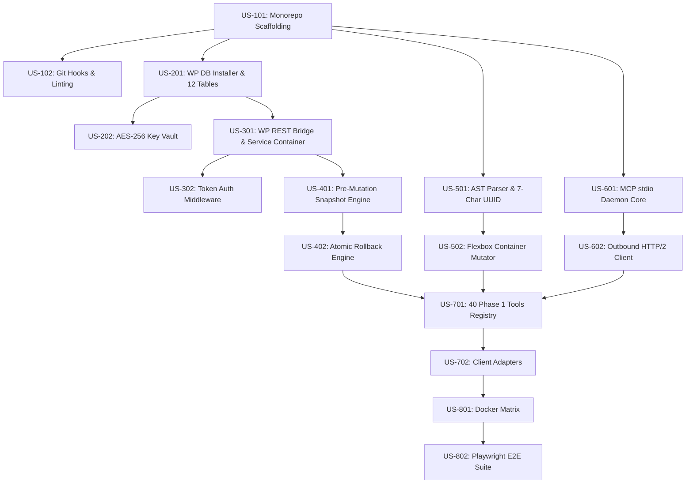

# Craftor — Sprint 1 Backlog, User Stories & Execution Plan

**Document ID:** SPRINT-01-2026-001  
**Project:** Craftor — Universal MCP Platform for WordPress, Elementor & WooCommerce  
**Sprint Window:** Sprint 1 (Weeks 1–2 / 10 Working Days)  
**Total Story Points:** 80 SP  
**Status:** Approved for Engineering Execution

---

## 1. Sprint 1 Goal & Scope

### 🎯 Primary Sprint Objective

Establish the foundational monorepo workspace, core WordPress database persistence layer, transactional snapshot/rollback state machine, Elementor Flexbox AST mutation engine, universal Node.js MCP server daemon (`stdio` transport), and the **Phase 1 (40 Core Tools) MVP baseline** with full E2E testing across Cursor and Claude Desktop.

```
┌─────────────────────────────────────────────────────────────────────────────────────────────────────────┐
│                                       SPRINT 1 CAPABILITY TARGET                                        │
├──────────────────────────┬──────────────────────────┬──────────────────────────┬────────────────────────┤
│ 1. MONOREPO & CORE       │ 2. SAFETY & PERSISTENCE  │ 3. ELEMENTOR AST         │ 4. MCP PROTOCOL        │
├──────────────────────────┼──────────────────────────┼──────────────────────────┼────────────────────────┤
│ • pnpm + Turborepo setup │ • 12 MySQL local tables  │ • Bi-directional parser  │ • Node/TS stdio daemon │
│ • Polyglot tsconfig/WPCS │ • Snapshot Engine        │ • Flexbox Containers     │ • JSON-RPC 2.0 router  │
│ • Docker test matrix     │ • 1-Click Rollback state │ • Post-CSS Cache Purge   │ • 40 Phase 1 Tools     │
│ • GitHub Actions CI      │ • AES-256 Token Vault    │ • 7-Char Hex UUID Engine │ • Client Configs (4x)  │
└──────────────────────────┴──────────────────────────┴──────────────────────────┴────────────────────────┘
```

---

## 2. Sprint 1 Epics Breakdown

```
┌────────────────────────────────────────────────────────────────────────────────────────────────────────┐
│                                        SPRINT 1 EPICS SUMMARY                                          │
├─────────┬────────────────────────────────────────────────────────┬──────────────┬──────────────────────┤
│ Epic ID │ Epic Title                                             │ Story Points │ Target Completion    │
├─────────┼────────────────────────────────────────────────────────┼──────────────┼──────────────────────┤
│ EPIC-01 │ Monorepo Workspace & Development Tooling Setup         │ 5 SP         │ Day 1                │
│ EPIC-02 │ WordPress Persistence & Database Migration Engine      │ 10 SP        │ Day 2–3              │
│ EPIC-03 │ WordPress Plugin REST Bridge & Auth Middleware         │ 10 SP        │ Day 3–4              │
│ EPIC-04 │ Transactional Snapshot & Micro-Rollback Engine         │ 16 SP        │ Day 5–6              │
│ EPIC-05 │ Elementor AST Parser & Flexbox Container Mutator       │ 16 SP        │ Day 6–7              │
│ EPIC-06 │ Universal MCP Server Core Daemon (stdio Transport)     │ 13 SP        │ Day 8                │
│ EPIC-07 │ Phase 1 (40 Core Tools) Registry & Client Adapters     │ 10 SP        │ Day 9                │
│ EPIC-08 │ CI/CD Testing Harness & Multi-Client E2E Verification  │ 10 SP        │ Day 10               │
├─────────┼────────────────────────────────────────────────────────┼──────────────┼──────────────────────┤
│ TOTAL   │ 8 Epics / 16 User Stories                              │ 80 SP        │ 10 Working Days      │
└─────────┴────────────────────────────────────────────────────────┴──────────────┴──────────────────────┘
```

---

## 3. Granular User Stories & Acceptance Criteria

### Epic 1: Monorepo Workspace & Development Tooling Setup (5 SP)

#### US-101: Workspace Scaffolding & Turborepo Task Pipeline (3 SP)

- **Description:** As an engineer, I need `pnpm-workspace.yaml`, `turbo.json`, and the shared TypeScript configuration hierarchy so that all packages build and test with cached parallelism.
- **Acceptance Criteria (Gherkin):**
  ```gherkin
  Scenario: Monorepo builds cleanly across all packages
    Given a fresh clone of the Craftor repository
    When the developer executes `pnpm install` and `pnpm build`
    Then all packages under `packages/` compile without TypeScript errors
    And Turborepo records a cache hit on subsequent executions.
  ```

#### US-102: Git Quality Hooks & Linting Pipeline (2 SP)

- **Description:** As a team lead, I need Husky, Commitlint, and ESLint/Prettier/PHPCS configs active so that malformed code or non-conventional commits are rejected before hitting origin.
- **Acceptance Criteria (Gherkin):**
  ```gherkin
  Scenario: Non-conventional commit is rejected
    Given a staged code change
    When committing with message "added some stuff"
    Then Commitlint rejects the commit and outputs the required Conventional Commit format.
  ```

---

### Epic 2: WordPress Persistence & Database Migration Engine (10 SP)

#### US-201: WordPress Plugin Database Installer & Schema Migrations (5 SP)

- **Description:** As the WordPress backend, I need automated database migration routines for all 12 core tables (`wp_craftor_*`) on plugin activation.
- **Acceptance Criteria (Gherkin):**
  ```gherkin
  Scenario: Plugin activation provisions all 12 core tables
    Given a clean WordPress 6.5 database
    When `craftor-core` is activated
    Then all 12 tables (`craftor_snapshots`, `craftor_activity_logs`, `craftor_tokens`, etc.) exist with correct primary keys and indexes.
  ```

#### US-202: AES-256-GCM Local Credential Vault (5 SP)

- **Description:** As a user, I need my BYOK API keys (OpenAI, Anthropic, Gemini) encrypted at rest in `wp_craftor_ai_providers`.
- **Acceptance Criteria (Gherkin):**
  ```gherkin
  Scenario: Stored API key is encrypted and decryptable
    Given an Anthropic API key `sk-ant-12345`
    When saved via the provider settings
    Then the raw string in MySQL is AES-256-GCM encrypted ciphertext
    And `EncryptionVault::decrypt()` retrieves the original key on authorized runtime calls.
  ```

---

### Epic 3: WordPress Plugin REST Bridge & Auth Middleware (10 SP)

#### US-301: PSR-4 Service Container & Route Registrar (5 SP)

- **Description:** As the plugin backend, I need a PSR-4 service container and REST route registrar under `/wp-json/craftor/v1/`.
- **Acceptance Criteria (Gherkin):**
  ```gherkin
  Scenario: REST endpoint responds with valid JSON schema
    Given an activated `craftor-core` plugin
    When an authenticated GET request is made to `/wp-json/craftor/v1/auth/handshake`
    Then the response status is 200 OK with site capabilities, active tools count, and version.
  ```

#### US-302: Constant-Time Token Auth Middleware (5 SP)

- **Description:** As a security engineer, I need incoming bearer tokens validated with constant-time SHA-256 `hash_equals()`.
- **Acceptance Criteria (Gherkin):**
  ```gherkin
  Scenario: Unauthenticated or invalid token is immediately rejected
    Given an incoming request with an invalid bearer token
    When evaluated by `AuthMiddleware`
    Then the request is rejected with HTTP 401 Unauthorized in <5ms without leaking timing information.
  ```

---

### Epic 4: Transactional Snapshot & Micro-Rollback Engine (16 SP)

#### US-401: Pre-Mutation State Capture with Gzip Compression (8 SP)

- **Description:** As an AI builder, I need an automated snapshot captured prior to every AI write operation.
- **Acceptance Criteria (Gherkin):**
  ```gherkin
  Scenario: State snapshot is captured with SHA-256 checksum
    Given a target post #104 containing 12 Elementor widgets
    When an AI mutation tool is dispatched
    Then a record is inserted in `wp_craftor_snapshots` containing compressed post data and `_elementor_data`
    And a unique snapshot UUID (e.g. `snp_8f921a44c0`) is returned in the response envelope.
  ```

#### US-402: Atomic 1-Click Rollback State Machine (8 SP)

- **Description:** As a user, I need to restore an exact previous page revision in $<50\text{ms}$ with zero layout artifacts.
- **Acceptance Criteria (Gherkin):**
  ```gherkin
  Scenario: Snapshot rollback restores exact pre-mutation state
    Given a page modified by an AI mutation with snapshot `snp_8f921a44c0`
    When `POST /wp-json/craftor/v1/snapshots/snp_8f921a44c0/restore` is called
    Then `wp_posts` and `_elementor_data` match the exact pre-mutation state
    And the Elementor Post-CSS cache is purged
    And an audit log is recorded in `wp_craftor_activity_logs`.
  ```

---

### Epic 5: Elementor AST Parser & Flexbox Container Mutator (16 SP)

#### US-501: Bi-Directional JSON AST Parser & 7-Char UUID Engine (8 SP)

- **Description:** As the Elementor engine, I need to deserialize `_elementor_data` JSON into a strongly typed AST tree and assign unique 7-character hexadecimal node IDs.
- **Acceptance Criteria (Gherkin):**
  ```gherkin
  Scenario: AST deserialization and serialization roundtrip
    Given a valid Elementor page JSON document
    When parsed via `AstParser::deserialize()` and re-serialized via `AstParser::serialize()`
    Then the resulting JSON passes Elementor Core schema validation with 100% fidelity.
  ```

#### US-502: Flexbox Container Mutation & CSS Cache Invalidation (8 SP)

- **Description:** As an AI client, I need to insert, style, and reorder modern Flexbox containers on a live page.
- **Acceptance Criteria (Gherkin):**
  ```gherkin
  Scenario: Flexbox container insertion
    Given a valid page ID #104
    When tool `elementor_create_container(page_id: 104, flex_direction: 'row')` is executed
    Then a new container node is appended to the AST root
    And the Post-CSS stylesheet is regenerated on disk.
  ```

---

### Epic 6: Universal MCP Server Core Daemon (stdio Transport) (13 SP)

#### US-601: Asynchronous Node/TS stdio Daemon & JSON-RPC 2.0 Router (8 SP)

- **Description:** As an AI IDE (Cursor / Claude Desktop), I need to spawn `craftor-mcp` over `stdio` and execute JSON-RPC 2.0 calls.
- **Acceptance Criteria (Gherkin):**
  ```gherkin
  Scenario: MCP stdio handshake and tool call
    Given a running `craftor-mcp` stdio process
    When the client sends `{"jsonrpc":"2.0","id":1,"method":"tools/list"}`
    Then the server responds on stdout with valid JSON-RPC containing the 40 Phase 1 tools
    And all internal debug logs are written exclusively to stderr.
  ```

#### US-602: Outbound HTTP/2 Keep-Alive Client with 30s Timeout (5 SP)

- **Description:** As the MCP server, I need a high-performance outbound HTTP/2 client connecting to the WordPress REST API bridge.
- **Acceptance Criteria (Gherkin):**
  ```gherkin
  Scenario: Outbound tool execution with timeout protection
    Given an active MCP server session
    When dispatching a mutation call to WordPress
    Then the request executes in <80ms over warm keep-alive TLS sockets
    And times out gracefully with a structured error if WordPress takes >30s.
  ```

---

### Epic 7: Phase 1 (40 Core Tools) Registry & Client Adapters (10 SP)

#### US-701: 40 Phase 1 Tools Schema Registration (5 SP)

- **Description:** As a developer, I need all 40 Phase 1 foundation tools strictly registered with JSON Schema Draft-07 definitions and version metadata.
- **Acceptance Criteria (Gherkin):**
  ```gherkin
  Scenario: All 40 Phase 1 tools pass schema validation
    Given the master tool registry package `@craftor/tool-registry`
    When `validate_registry.py` is executed
    Then 40 tools pass schema validation with zero duplicate IDs and explicit capability permissions.
  ```

#### US-702: Client Configuration Generators (5 SP)

- **Description:** As a user, I need ready-to-use configuration presets for Claude Desktop, Cursor, Claude Code, and VS Code.
- **Acceptance Criteria (Gherkin):**
  ```gherkin
  Scenario: Generating Cursor MCP configuration
    Given an active site `https://mysite.local` and token `crf_sec_123`
    When the user requests the Cursor config
    Then a valid `.cursor/mcp.json` snippet is produced ready for copy-pasting.
  ```

---

### Epic 8: CI/CD Testing Harness & Multi-Client E2E Verification (10 SP)

#### US-801: Virtualized Multi-Version Docker Test Beds (5 SP)

- **Description:** As a QA engineer, I need a Docker Compose matrix testing PHP 7.4–8.3 and WordPress 6.0–6.5.
- **Acceptance Criteria (Gherkin):**
  ```gherkin
  Scenario: Docker matrix provisions and passes health check
    Given `docker-compose up -d` is executed in `docker/`
    When the WordPress test containers initialize
    Then all test endpoints return HTTP 200 and MySQL connection tests pass.
  ```

#### US-802: Automated Playwright E2E & Visual Regression Suite (5 SP)

- **Description:** As a release manager, I need automated Playwright tests asserting end-to-end page generation and snapshot rollback in headless browsers.
- **Acceptance Criteria (Gherkin):**
  ```gherkin
  Scenario: E2E suite execution passes with >=90% coverage
    Given the complete Sprint 1 build
    When `pnpm test:e2e` is executed in CI
    Then 100% of Playwright tests pass
    And line coverage across PHP and TS packages exceeds 90%.
  ```

---

## 4. Task Dependency Graph & Critical Path



### 🔴 Critical Path:

`US-101` $\rightarrow$ `US-201` $\rightarrow$ `US-301` $\rightarrow$ `US-401` $\rightarrow$ `US-402` $\rightarrow$ `US-501` $\rightarrow$ `US-502` $\rightarrow$ `US-701` $\rightarrow$ `US-802`.

---

## 5. Risk Analysis & Mitigation Matrix

```
┌────────────────────────────────────────────────────────────────────────────────────────────────────────┐
│                                   SPRINT 1 RISK MANAGEMENT MATRIX                                      │
├────────────────────┬──────────────┬────────────────────────────────────────────────────────────────────┤
│ Risk Event         │ Severity     │ Preventative Mitigation Strategy                                   │
├────────────────────┼──────────────┼────────────────────────────────────────────────────────────────────┤
│ 1. stdio Stream    │ High         │ Strict architectural invariant: All debug logging piped to `stderr`│
│    Corruption      │              │ only. Zero non-JSON text emitted on `stdout`.                      │
├────────────────────┼──────────────┼────────────────────────────────────────────────────────────────────┤
│ 2. Elementor AST   │ Critical     │ Rigorous pre-flight AST validation schema with required control    │
│    Corruption      │              │ defaults before saving to `_elementor_data`.                       │
├────────────────────┼──────────────┼────────────────────────────────────────────────────────────────────┤
│ 3. Incomplete      │ High         │ Database transactions wrapped in `$wpdb->query('START TRANSACTION')│
│    Rollbacks       │              │ with automated rollback on any sub-step failure.                   │
├────────────────────┼──────────────┼────────────────────────────────────────────────────────────────────┤
│ 4. Slow REST Call  │ Medium       │ Warm HTTP/2 keep-alive socket connection pool maintained between   │
│    Latency         │              │ Node.js MCP server and WordPress.                                  │
└────────────────────┴──────────────┴────────────────────────────────────────────────────────────────────┘
```

---

## 6. Daily Execution & Implementation Schedule

```
Day 01: [US-101, US-102] Monorepo workspace scaffolding, Turborepo pipeline, Husky hooks.
Day 02: [US-201] WordPress 12 core tables installer & `dbDelta` migration engine.
Day 03: [US-202, US-301] AES-256 Vault & PSR-4 REST API route registrar.
Day 04: [US-302] Constant-time SHA-256 token authentication & capability guards.
Day 05: [US-401] Pre-mutation snapshot engine with gzip compression & checksums.
Day 06: [US-402, US-501] Atomic rollback engine & bi-directional AST Parser.
Day 07: [US-502] Flexbox container mutator & Post-CSS stylesheet regenerator.
Day 08: [US-601, US-602] Node/TS stdio MCP daemon, JSON-RPC router & HTTP/2 client.
Day 09: [US-701, US-702] 40 Phase 1 Tools registration & client adapters (Cursor/Claude).
Day 10: [US-801, US-802] Docker test matrix execution, Playwright E2E certification & DoD sign-off.
```

---

_This backlog serves as the official Sprint 1 execution blueprint. All 10 autonomous AI engineering teams will implement tasks strictly in accordance with these user stories and dependency orders._
