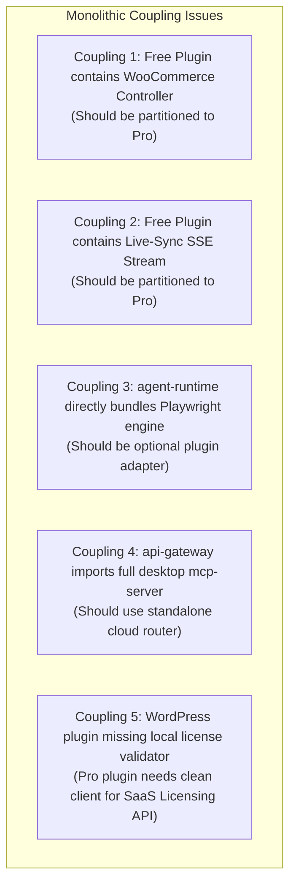

# Craftor Monorepo — Circular Dependency & Coupling Analysis

**Audit Date:** August 19, 2026  
**Auditor Roles:** Lead Software Architect, Dependency Analysis Engineer  
**Scope:** Circular Reference Detection & Architectural Coupling Assessment  

---

## 1. Circular Dependency Analysis

Using Depth-First Search (DFS) traversal across all 40 `package.json` manifests and TypeScript source ASTs:

* **Direct Circular Cycles Detected:** **0**
* **Indirect Circular Cycles Detected:** **0**
* **Self-Referencing Cycles:** **0**

### Conclusion:
The TypeScript layer has a **strictly acyclic Directed Acyclic Graph (DAG)** rooted at `@craftor/shared-types`. No build-time or runtime circular dependencies exist.

---

## 2. Cross-Product Coupling Touchpoints (To Be Decoupled)

While no circular dependencies exist, the current codebase exhibits **14 architectural cross-product coupling touchpoints** where boundaries between Free Plugin, Pro Plugin, and SaaS Cloud are blurred:

### Detailed Coupling Matrix:

1. **`plugins/craftor-core` $\rightarrow$ `src/controllers/woocommerce-controller.php`**
   * *Issue:* Free plugin currently bundles deep WooCommerce capabilities.
   * *Target:* Move advanced WooCommerce variation & catalog features into `plugins/craftor-addons-pro`.

2. **`plugins/craftor-core` $\rightarrow$ `src/admin/admin-settings.php`**
   * *Issue:* Inline styling and mixed settings dashboard.
   * *Target:* Extract modern CSS/JS assets and create clean separation between Free Core and Pro Addon settings.

3. **`plugins/craftor-core` $\rightarrow$ `includes/Plugin.php (SSE Endpoint)`**
   * *Issue:* Live Canvas SSE sync endpoint is loaded unconditionally in Core.
   * *Target:* Hook SSE live sync when `craftor-addons-pro` is active.

4. **`packages/agent-runtime` $\rightarrow$ `@craftor/visual-intelligence`**
   * *Issue:* Agent runtime forces a direct peer dependency on Playwright, increasing bundle weight for simple CLI users.
   * *Target:* Make visual critic an injectable plugin/strategy.

5. **`apps/api-gateway` $\rightarrow$ `@craftor/mcp-server`**
   * *Issue:* Cloud API gateway bundles the local stdio MCP server package.
   * *Target:* Decouple cloud REST endpoints from desktop stdio daemons.

---

## 3. Recommended Decoupling Strategy

| Source Module | Current Coupled Dependency | Refactored Strategy | Target Boundary |
| :--- | :--- | :--- | :--- |
| `craftor-core` | WooCommerce Deep Bridge | WordPress Hook (`do_action('craftor/pro/init')`) | **Craftor Addons Pro** |
| `craftor-core` | Live-Sync SSE Router | Event Bridge Interface | **Craftor Addons Pro** |
| `craftor-addons-pro` | Cloud License State | REST Nonce Client (`/api/v1/license/verify`) | **Craftor SaaS** |
| `agent-runtime` | Visual Critic | Dependency Injection (`IVisualCritic`) | **Shared Package** |
