# Craftor Monorepo — Dependency Graph & Topology Analysis

**Audit Date:** August 19, 2026  
**Auditor Roles:** Lead Software Architect, Monorepo Specialist, Dependency Analysis Engineer  
**Scope:** Internal & External Dependency Graph Mapping  

---

## 1. Internal Dependency Graph

```mermaid
graph TD
    %% Core Shared Foundation
    Types["@craftor/shared-types"]
    Utils["@craftor/shared-utils"]
    Schemas["@craftor/schemas"]
    Tokens["@craftor/design-tokens"]
    
    Utils --> Types
    Schemas --> Types

    %% AST & Bridge Layer
    AST["@craftor/elementor-ast"]
    WPBridge["@craftor/wordpress-bridge"]
    
    AST --> Types
    AST --> Utils
    WPBridge --> Types
    WPBridge --> Utils
    WPBridge --> Schemas
    WPBridge --> AST

    %% Tooling & Registry Layer
    ToolReg["@craftor/tool-registry"]
    SkillReg["@craftor/skill-registry"]
    AgentReg["@craftor/agent-registry"]
    WorkflowReg["@craftor/workflow-registry"]
    
    ToolReg --> Types
    ToolReg --> Schemas
    SkillReg --> Types
    AgentReg --> Types
    AgentReg --> SkillReg
    WorkflowReg --> Types

    %% Client Adapters
    AdapterShared["@craftor/client-adapter-shared"]
    Adapters["@craftor/client-adapters"]
    AdapterShared --> Types
    Adapters --> AdapterShared

    %% MCP Daemon
    MCP["@craftor/mcp-server"]
    MCP --> Types
    MCP --> Utils
    MCP --> ToolReg
    MCP --> SkillReg
    MCP --> AgentReg
    MCP --> WorkflowReg
    MCP --> AST
    MCP --> Adapters
    MCP --> Tokens
    MCP --> Schemas
    MCP --> WPBridge

    %% Visual Intelligence & Agent Runtime
    Visual["@craftor/visual-intelligence"]
    AgentRuntime["@craftor/agent-runtime"]
    
    Visual --> AST
    Visual --> Types
    Visual --> Utils
    AgentRuntime --> Types
    AgentRuntime --> Utils
    AgentRuntime --> Schemas
    AgentRuntime --> AST
    AgentRuntime --> WPBridge
    AgentRuntime --> Visual

    %% Cloud SaaS Services
    SvcLicensing["@craftor/service-licensing"]
    SvcBilling["@craftor/service-billing"]
    SvcUpdate["@craftor/service-update"]
    SvcAnalytics["@craftor/service-analytics"]
    SvcAuth["@craftor/service-authentication"]
    
    SvcLicensing --> Types
    SvcBilling --> Types
    SvcUpdate --> Types
    SvcUpdate --> Utils
    SvcAnalytics --> Types
    SvcAuth --> Types
    SvcAuth --> Utils

    %% Apps
    Gateway["@craftor/api-gateway"]
    Dashboard["@craftor/dashboard"]
    
    Gateway --> Types
    Gateway --> Utils
    Gateway --> MCP
    Dashboard --> Tokens
    Dashboard --> Types
```

---

## 2. Package Dependency Mapping Table

| Package Name | Depends On (Internal) | Depended On By | Layer |
| :--- | :--- | :--- | :--- |
| `@craftor/shared-types` | *None (Root)* | All 24 packages, apps, and services | **Level 0 (Leaf)** |
| `@craftor/shared-utils` | `@craftor/shared-types` | `elementor-ast`, `wordpress-bridge`, `mcp-server`, `agent-runtime`, `visual-intelligence`, `services/*` | **Level 1** |
| `@craftor/schemas` | `@craftor/shared-types` | `wordpress-bridge`, `mcp-server`, `tool-registry`, `agent-runtime` | **Level 1** |
| `@craftor/design-tokens` | *None* | `mcp-server`, `dashboard`, `marketing`, `shared-ui` | **Level 1** |
| `@craftor/elementor-ast` | `shared-types`, `shared-utils` | `wordpress-bridge`, `mcp-server`, `agent-runtime`, `visual-intelligence` | **Level 2** |
| `@craftor/wordpress-bridge` | `shared-types`, `shared-utils`, `schemas`, `elementor-ast` | `mcp-server`, `agent-runtime` | **Level 3** |
| `@craftor/visual-intelligence` | `shared-types`, `shared-utils`, `elementor-ast` | `agent-runtime` | **Level 3** |
| `@craftor/mcp-server` | `shared-types`, `shared-utils`, `schemas`, `tool-registry`, `skill-registry`, `agent-registry`, `workflow-registry`, `elementor-ast`, `client-adapters`, `design-tokens`, `wordpress-bridge` | `api-gateway` | **Level 4** |
| `@craftor/agent-runtime` | `shared-types`, `shared-utils`, `schemas`, `elementor-ast`, `wordpress-bridge`, `visual-intelligence` | High-level CLI / Orchestrator | **Level 4** |

---

## 3. External Dependency Mapping

| External Dependency | Used By | Version | Category |
| :--- | :--- | :--- | :--- |
| `zod` | `@craftor/schemas`, `@craftor/tool-registry` | `^3.23.0` | Schema validation |
| `playwright` | `@craftor/visual-intelligence` | `^1.45.0` | Headless browser rasterization |
| `typescript` | All workspace packages | `^5.4.0` | Type checking |
| `turbo` | Root workspace | `^1.13.0` | Monorepo task cache |
| `pnpm` | Package manager | `9.0.0` | Workspace linking |
| `node-fetch` / `undici` | `@craftor/wordpress-bridge` | Native / Polyfill | HTTP Transport |
