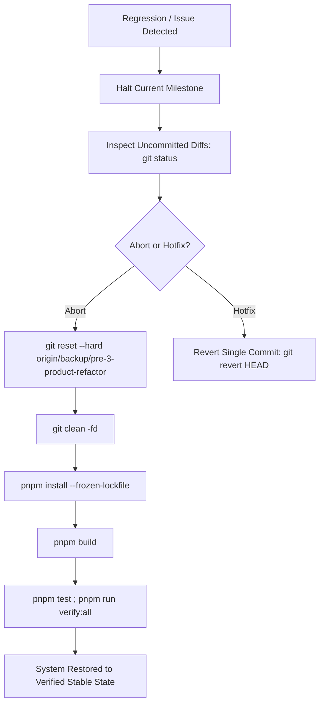

# Craftor Monorepo — Rollback Plan & Disaster Recovery Strategy

**Audit Date:** August 19, 2026  
**Auditor Roles:** Lead Software Architect, DevOps Engineer, Release Manager  
**Scope:** Automated & Manual Recovery Protocols for 3-Product Refactoring  

---

## 1. Backup Verification Status

| Backup Asset | Location / Identifier | Verification Status |
| :--- | :--- | :--- |
| **Git Safety Backup Branch** | `origin/backup/pre-3-product-refactor` | **VERIFIED & PUSHED (SHA: `9e1f28b`)** |
| **Release Tag Baseline** | `v1.0.0-ga` | **VERIFIED (Immutable Tag)** |
| **Plugin Distribution Baseline** | `dist-bin/craftor-core-1.0.0.zip` | **VERIFIED (SHA-256 Digest Certified)** |
| **Docker MariaDB State** | `craftor_test` database container | **VERIFIED (Transactional snapshots table active)** |

---

## 2. Fast Rollback Procedure (Single-Command Restoration)

If any refactoring step fails or produces unexpected regressions, run the following fast rollback command in PowerShell:

```powershell
# Fast Restoration to Pre-Refactor Baseline
git reset --hard origin/backup/pre-3-product-refactor
git clean -fd
pnpm install
pnpm build ; pnpm lint ; pnpm test ; pnpm run verify:all
```

---

## 3. Step-by-Step Emergency Recovery Playbook



### Protocol Steps:
1. **Halt Execution:** Immediately stop file modifications and do not push unverified commits.
2. **Isolate Scope:** If an isolated module has an issue, revert only the target module (`git checkout origin/backup/pre-3-product-refactor -- <path>`).
3. **Full Emergency Abort:** If systemic issues occur, execute the Fast Restoration command above.
4. **Re-Run Ecosystem Audit:** Run `pnpm run verify:all` to ensure all 210 ecosystem checks pass 100%.

---

## 4. Database & Container Rollback Protocol

If Docker test database tables need reset during WordPress testing:

```powershell
# Reset Docker MariaDB to Clean Seed State
docker compose down -v
docker compose up -d
# Run WordPress initialization script
docker compose exec -T wordpress bash /docker/init-wordpress.sh
```
